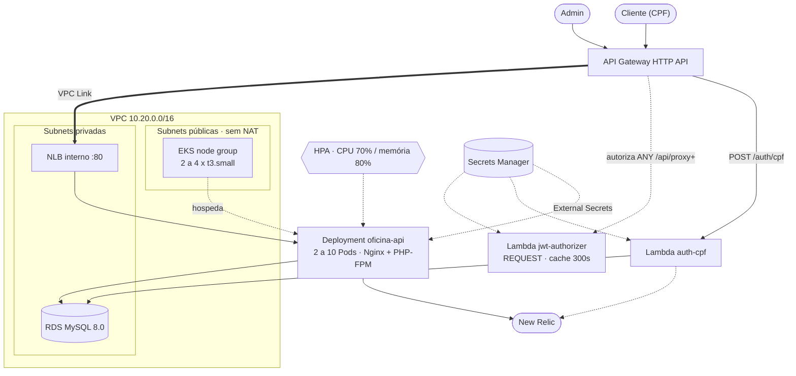

# Oficina Mecânica API

[](https://github.com/bregaldahq/oficina-mecanica-tech-challenge/actions/workflows/ci-cd.yml)
[](https://php.net)
[](https://mysql.com)
[](https://phpunit.de)
[](swagger.yaml)
[](Dockerfile)

API REST cloud-native em **PHP 8.2 puro** (sem frameworks MVC) para gerenciar o ciclo completo de atendimento de uma oficina mecânica. O projeto foi desenvolvido como **Tech Challenge** da pós-graduação SOAT (Software Architecture) e demonstra, na prática, DDD, Clean Architecture, TDD, observabilidade de saúde e automação de infraestrutura e entrega.

---

## Sobre o Projeto

O sistema gerencia o ciclo de vida completo de ordens de serviço automotivas: recepção do veículo, diagnóstico, aprovação de orçamento, execução dos serviços, controle de estoque de peças e entrega ao cliente — tudo sem nenhum framework MVC.

### Tecnologias

| Categoria | Tecnologia |
|-----------|-----------|
| Linguagem | PHP 8.2+ (puro, sem Laravel/Symfony) |
| Banco de dados | MySQL 8.0 — Amazon RDS `db.t4g.micro` |
| Autenticação | JWT HS256 em PHP puro + Lambda Authorizer no API Gateway |
| Testes | PHPUnit 11 (unitários + integração com SQLite in-memory) |
| Análise estática | PHPStan nível 8 |
| Formatação | PHP-CS-Fixer (PSR-12) |
| Documentação | OpenAPI 3.0 + Swagger UI · ADRs e RFCs em `docs/fase-3/` |
| Containerização | Docker multi-stage (`php:8.2-fpm-bookworm`) + Nginx |
| Orquestração | Amazon EKS 1.30 + HPA (2 a 10 réplicas) |
| Manifestos | Kustomize — `deploy/base` + `deploy/overlays/{hml,prod}` |
| Entrada | API Gateway HTTP API + VPC Link + NLB interno |
| Serverless | AWS Lambda (Bref) — `auth-cpf` e `jwt-authorizer` |
| Segredos | AWS Secrets Manager + External Secrets Operator |
| Contratos entre stacks | AWS SSM Parameter Store |
| Infraestrutura como Código | Terraform (3 repositórios dedicados) |
| CI/CD | GitHub Actions com OIDC (sem access key estática) |
| Observabilidade | New Relic — APM, logs estruturados, custom events, alertas |
| Notificações | Email via cliente SMTP próprio (PHP puro) |

### Por que MySQL?

- **ACID:** Transações garantem que a reserva de estoque e o registro da OS sejam atômicos.
- **Integridade Referencial:** Chaves estrangeiras impedem que uma OS referencie cliente ou veículo inexistente.
- **Relações Complexas:** Modelo com 7 tabelas e relações N:M (OS ↔ Peças, OS ↔ Serviços) naturalmente expressas em SQL.

---

## Fase 3 — Arquitetura distribuída na AWS

A Fase 3 tira a aplicação do cluster local e a coloca em **AWS**, quebrando a entrega em **quatro
repositórios com ciclos de vida próprios**, adicionando **autenticação do cliente final por CPF** e
**observabilidade de ponta a ponta** no New Relic.

> **Toda a documentação da fase está em [`docs/fase-3/`](docs/fase-3/)** — o documento normativo de
> contratos entre os repositórios, 10 ADRs, 3 RFCs, diagramas, dashboards e alertas.

### O que mudou em relação à Fase 2

| Fase 2 | Fase 3 |
|---|---|
| Monolito containerizado em cluster kind local | EKS na AWS, atrás de API Gateway |
| Um repositório com `k8s/` e `infra/` | Quatro repositórios; `k8s/` e `infra/` **removidos** |
| Manifestos avulsos | **Kustomize** (`deploy/base` + overlays `hml`/`prod`) |
| MySQL em StatefulSet | **RDS MySQL 8.0** em subnet privada |
| Segredos em `Secret` do cluster | **Secrets Manager** via External Secrets Operator |
| Consulta pública de OS por CPF+placa | **Removida** — substituída por `POST /auth/cpf` + `GET /api/service-orders/me` |
| Só autenticação de admin | Dois papéis: `admin` e `customer` |
| `ci-cd.yml` único | `pr.yml` + `deploy.yml`, com **OIDC** |
| Health check único | `/api/health` (liveness) e `/api/ready` (readiness) |
| Logs não estruturados | **Log JSON** com `correlation_id` propagado |
| Sem observabilidade | New Relic: APM, logs, custom events de negócio, alertas |
| HPA 2 → 6 | HPA 2 → 10 |

### Os quatro repositórios

A divisão segue o **ciclo de vida** dos recursos, não as camadas técnicas (ADR-008):

| Repositório | Possui | Muda |
|---|---|---|
| `oficina-infra-database` | VPC, subnets, RDS, **todos os segredos**, migrations | raríssimo |
| `oficina-infra-k8s` | EKS, node group, add-ons, ECR, NLB interno + target group | ocasional |
| `oficina-lambda-auth` | Lambdas `auth-cpf` e `jwt-authorizer`, API Gateway, VPC Link | ocasional |
| **`oficina-mecanica-tech-challenge`** (este) | aplicação, `deploy/` em kustomize, Job de migration | diário |

O acoplamento entre eles é **exclusivamente por SSM Parameter Store** — nenhum usa
`terraform_remote_state` (ADR-008). O repositório de banco é a **camada de fundação**: possui tudo
que é durável, de modo que o cluster pode ser destruído e recriado sem risco ao dado nem aos
tokens em circulação (ADR-009).

Ordem de `apply`: **database → k8s → lambda → app**. Ordem de `destroy`: inversa.

### Arquitetura provisionada



Diagramas completos — componentes com propriedade por repositório, sequência da autenticação com
todos os ramos de erro e sequência da abertura de OS com telemetria — em
[`docs/fase-3/diagramas/`](docs/fase-3/diagramas/).

### Autenticação e autorização

Dois públicos, dois caminhos:

| Ator | Como obtém o token | `role` | Alcance |
|---|---|---|---|
| **Cliente** | `POST /auth/cpf` (Lambda, no gateway) | `customer` | `GET /api/service-orders/me` e a própria OS |
| **Admin** | `POST /api/auth/login` (aplicação) | `admin` | todo o `/api/**` |
| **Webhook** | header `X-Webhook-Token` obrigatório | — | apenas `POST /api/service-orders/{id}/approval` |

Detalhe técnico que determina o desenho: o **JWT Authorizer nativo** do API Gateway HTTP API só
valida emissores OIDC com JWKS — **não valida HS256**, porque precisaria conhecer o segredo
simétrico. Por isso a validação fica num **Lambda Authorizer do tipo REQUEST**, com
`authorizer_result_ttl_in_seconds = 300`. O caminho de evolução para RS256 com JWKS está detalhado
na [RFC-003](docs/fase-3/rfc/003-estrategia-de-autenticacao.md).

A aplicação **revalida o JWT localmente** em toda rota protegida — defesa em profundidade: ela
nunca confia em header injetado pelo gateway.

> **Correção de segurança da fase.** A rota pública `GET /api/service-orders/status` aceitava
> `document` e `license_plate` por query string, sem autenticação, e expunha a OS de qualquer CPF
> conhecido (OWASP A01 — Broken Access Control). Foi **removida** e substituída por
> `GET /api/service-orders/me`, que devolve apenas as OS do `sub` do token.

### Observabilidade

- **Log estruturado** em JSON, uma linha por requisição, com `correlation_id` lido de
  `X-Request-Id`, ou de `X-Amzn-Trace-Id`, ou gerado — e sempre devolvido no header da resposta.
- **Custom events de negócio** — `ServiceOrderCreated` e `ServiceOrderStatusChanged` — emitidos
  por um assinante dos **eventos de domínio que já existiam**, sem instrumentação espalhada pelo
  código. Sem a extensão do New Relic carregada, a emissão é no-op silencioso.
- **APM** com distributed tracing, `NEW_RELIC_APP_NAME = oficina-api-<env>`.
- **Dois dashboards** e **nove condições de alerta** prontos para importar, em
  [`docs/fase-3/newrelic/`](docs/fase-3/newrelic/).

### Decisões documentadas

| | |
|---|---|
| **[ADRs](docs/fase-3/adr/)** | 10 decisões arquiteturais, com consequências negativas assumidas e alternativas descartadas |
| **[RFCs](docs/fase-3/rfc/)** | escolha da nuvem · banco gerenciado · estratégia de autenticação |
| **[Contratos](docs/fase-3/CONTRATOS.md)** | documento normativo entre os quatro repositórios |

---

## Arquitetura

```
┌─────────────────────────────────────────────────────────────┐
│                    PRESENTATION LAYER                        │
│   Router → AuthMiddleware → Controllers → RequestValidator   │
└──────────────────────────────┬──────────────────────────────┘
                               │ DTOs
┌──────────────────────────────▼──────────────────────────────┐
│                    APPLICATION LAYER                         │
│               Use Cases + Input/Output DTOs                  │
└──────────────────────────────┬──────────────────────────────┘
                               │ Repository Interfaces
┌──────────────────────────────▼──────────────────────────────┐
│                      DOMAIN LAYER                            │
│  Aggregate Root · Entities · Value Objects · Domain Events   │
│  Repository Interfaces · Domain Exceptions                   │
└──────────────────────────────┬──────────────────────────────┘
                               │ Implementations
┌──────────────────────────────▼──────────────────────────────┐
│                  INFRASTRUCTURE LAYER                        │
│   PDO Repositories · JwtProvider · UuidGenerator             │
│   PdoConnection · EnvLoader · InMemoryEventDispatcher        │
│   JsonLogger · RequestContext · Subscribers de evento        │
└─────────────────────────────────────────────────────────────┘
```

O domínio não tem nenhuma dependência externa, não conhece PDO, HTTP ou JWT.

### Fluxo da Ordem de Serviço (State Machine)

```
  RECEIVED ──► DIAGNOSIS ──► AWAITING_APPROVAL ──► EXECUTING ──► FINISHED ──► DELIVERED
     │              │                │                   │             │
  recepção     diagnóstico       orçamento           aprovação     execução    entrega
```

Cada transição é um método nomeado no Aggregate Root — nunca um `setStatus()` genérico:

| Método | De | Para |
|--------|----|------|
| `changeToDiagnosis()` | RECEIVED | DIAGNOSIS |
| `sendForApproval()` | DIAGNOSIS | AWAITING_APPROVAL |
| `approve()` | AWAITING_APPROVAL | EXECUTING |
| `reject()` | AWAITING_APPROVAL | REJECTED |
| `finish()` | EXECUTING | FINISHED |
| `deliver()` | FINISHED | DELIVERED |

Transições inválidas lançam `InvalidStatusTransitionException`.

> `reject()` encerra a OS quando o orçamento é recusado, exposto pelo endpoint
> `POST /api/service-orders/{id}/approval`.

Toda mudança de status emite um **evento de domínio**, consumido por três assinantes
independentes — o que permitiu acrescentar histórico e telemetria sem tocar no domínio:

| Assinante | O que faz |
|---|---|
| `StatusChangeEmailNotifier` | Notifica por email (quando o SMTP está configurado) |
| `StatusHistorySubscriber` | Grava a transição em `service_order_status_history` |
| `NewRelicSubscriber` | Emite `ServiceOrderCreated` / `ServiceOrderStatusChanged` (no-op sem a extensão) |

### Modelo de Dados

```
customers ──────────────── vehicles
    │                          │
    └──── service_orders ───────┘
               │
               ├── service_order_services ─── service_catalog
               ├── service_order_parts ────── parts_inventory
               └── service_order_status_history
```

O schema é versionado em `migrations/NNN_<slug>.sql` no repositório `oficina-infra-database` e
aplicado pelo runner `bin/migrate.php`, que controla o que já rodou na tabela `schema_migrations`.
O modelo de dados completo — diagrama ER, dicionário de dados e a justificativa da escolha do
MySQL — está documentado naquele repositório e na
[RFC-002](docs/fase-3/rfc/002-banco-gerenciado.md).

---

## Decisões de Design (ADRs)

As decisões arquiteturais estão registradas como ADRs completas — com contexto, consequências
positivas **e negativas**, e as alternativas descartadas — em
**[`docs/fase-3/adr/`](docs/fase-3/adr/)**.

| ADR | Decisão |
|---|---|
| [001](docs/fase-3/adr/001-php-puro-sem-framework.md) | PHP 8.2 puro, sem framework MVC |
| [002](docs/fase-3/adr/002-jwt-implementado-manualmente.md) | JWT HS256 implementado manualmente |
| [003](docs/fase-3/adr/003-state-machine-metodos-nomeados.md) | Máquina de estados com métodos nomeados no Aggregate Root |
| [004](docs/fase-3/adr/004-transacoes-no-repositorio.md) | Controle transacional dentro do repositório |
| [005](docs/fase-3/adr/005-reconstitute-para-hidratacao.md) | `reconstitute()` para hidratação do agregado |
| [006](docs/fase-3/adr/006-comunicacao-sincrona-rest-api-gateway.md) | Comunicação síncrona REST via API Gateway |
| [007](docs/fase-3/adr/007-hpa-cpu-memoria.md) | Autoescalonamento por HPA em CPU e memória |
| [008](docs/fase-3/adr/008-quatro-repositorios-acoplamento-ssm.md) | Quatro repositórios com acoplamento por SSM Parameter Store |
| [009](docs/fase-3/adr/009-banco-como-camada-de-fundacao.md) | O repositório de banco é a camada de fundação |
| [010](docs/fase-3/adr/010-nodes-em-subnet-publica-sem-nat.md) | Nodes do EKS em subnet pública, sem NAT Gateway |

As **RFCs** que fundamentaram as decisões de plataforma estão em
[`docs/fase-3/rfc/`](docs/fase-3/rfc/): escolha da nuvem, banco gerenciado e estratégia de
autenticação.

---

## Linguagem Ubíqua (Glossário)

| Termo | Descrição |
|-------|-----------|
| **Ordem de Serviço (OS)** | Contrato de atendimento entre cliente e oficina |
| **Diagnóstico** | Avaliação técnica do veículo |
| **Orçamento** | Total calculado a partir dos serviços e peças da OS |
| **Aprovação** | Aceite do cliente que libera a execução |
| **Serviço** | Trabalho técnico realizado (ex: Troca de óleo) |
| **Peça** | Item de estoque consumido durante um serviço |
| **Documento** | CPF (11 dígitos) ou CNPJ (14 dígitos) do cliente |
| **Placa** | Identificador único do veículo (formato antigo ou Mercosul) |

> O **Domain Storytelling** dos dois fluxos principais (abertura/acompanhamento e
> diagnóstico → entrega) está documentado em
> [`docs/DOMAIN-STORYTELLING.md`](docs/DOMAIN-STORYTELLING.md).

---

## Estrutura de Diretórios

```
oficina-mecanica-tech-challenge/
├── src/
│   ├── Domain/                     # sem nenhuma dependência externa
│   │   ├── Aggregate/              # ServiceOrder (Aggregate Root, máquina de estados)
│   │   ├── Entity/                 # Customer, Vehicle, Part, ServiceItem
│   │   ├── Event/                  # DomainEventInterface, eventos tipados
│   │   ├── Exception/              # Exceções de domínio tipadas
│   │   ├── Notification/           # MailerInterface
│   │   ├── Repository/             # Interfaces dos repositórios
│   │   └── ValueObject/            # Document (CPF/CNPJ), LicensePlate, CustomerStatus
│   ├── Application/
│   │   ├── DTO/                    # Input DTOs por contexto
│   │   └── UseCase/                # Use Cases por contexto
│   ├── Infrastructure/
│   │   ├── Config/                 # EnvLoader
│   │   ├── Context/                # RequestContext (correlation_id)
│   │   ├── Database/               # PdoConnection (Singleton + setInstance)
│   │   ├── Event/                  # InMemoryEventDispatcher + subscribers
│   │   ├── Logging/                # JsonLogger (log estruturado, seção 7 dos Contratos)
│   │   ├── Notification/           # Cliente SMTP próprio
│   │   ├── Repository/             # Implementações PDO
│   │   └── Security/               # JwtProvider (PHP puro, HS256)
│   └── Presentation/
│       ├── Controller/             # Controllers HTTP
│       ├── Middleware/             # AuthMiddleware, CorrelationIdMiddleware
│       ├── Request/                # RequestValidator
│       └── Router/                 # Roteador regex com {param} e requireRole()
├── tests/
│   ├── Unit/                       # domínio, use cases, infraestrutura, apresentação
│   └── Integration/                # SQLite in-memory
├── deploy/                         # manifestos Kubernetes em kustomize
│   ├── base/                       # Deployment, Service, HPA, ExternalSecret,
│   │                               # TargetGroupBinding, Job de migration, ConfigMaps
│   └── overlays/
│       ├── hml/                    # namespace, réplicas, recursos, tag da imagem
│       └── prod/                   # + PodDisruptionBudget
├── docs/
│   ├── fase-3/                     # ADRs, RFCs, diagramas, New Relic, Postman, roteiro
│   ├── DOMAIN-STORYTELLING.md
│   └── index.html                  # Swagger UI
├── bin/migrate.php                 # runner de migrations versionado (schema_migrations)
├── scripts/                        # php.sh, composer.sh (execução via Docker)
├── public/index.php                # front controller + matriz de autorização
├── docker/                         # php.ini e entrypoint
├── .github/workflows/
│   ├── pr.yml                      # lint + testes + análise estática
│   └── deploy.yml                  # OIDC → ECR → EKS → migration → smoke → New Relic
├── Dockerfile                      # multi-stage (vendor → dev → production), bookworm
├── docker-compose.yml · nginx.conf · Makefile
├── phpunit.xml · phpstan.neon · .php-cs-fixer.php
├── swagger.yaml
└── SECURITY_REPORT.md
```

> `k8s/` e `infra/` **não existem mais**. Os manifestos migraram para `deploy/` em kustomize, e o
> Terraform migrou para os três repositórios de infraestrutura descritos na seção da Fase 3.

---

## Pré-requisitos

**Para rodar localmente:** Docker 20.10+ e Docker Compose 2.0+. Não é preciso ter PHP nem Composer
na máquina — `scripts/php.sh` e `scripts/composer.sh` executam tudo dentro de container.

**Para implantar na AWS:** `kubectl`, `awscli` v2, `terraform` 1.5+ e uma conta AWS com os três
repositórios de infraestrutura já aplicados na ordem **database → k8s → lambda**.

---

## Como Executar

```bash
# 1. Clone o repositório
git clone https://github.com/bregaldahq/oficina-mecanica-tech-challenge.git
cd oficina-mecanica-tech-challenge

# 2. Configure as variáveis de ambiente
cp .env.example .env
# Edite .env — obrigatórios: JWT_SECRET, DB_HOST, DB_DATABASE, DB_USERNAME, DB_PASSWORD, ADMIN_USERNAME, ADMIN_PASSWORD
# Opcionais: WEBHOOK_TOKEN (webhook de aprovação) e SMTP_HOST/SMTP_PORT/SMTP_USERNAME/SMTP_PASSWORD/MAIL_FROM/MAIL_TO (email de status)

# 3. Suba os containers (build + start)
make up

# 4. Instale as dependências do Composer dentro do container
make install

# 5. Execute as migrações
make migrate

# 6. Verifique os health checks
curl http://localhost:8080/api/health   # liveness — não toca no banco
curl http://localhost:8080/api/ready    # readiness — checa o banco
```

Acesse:
- **API:** `http://localhost:8080/api/`
- **Swagger UI:** `http://localhost:8080/docs/`
- **Health:** `http://localhost:8080/api/health`

### Atalhos com Makefile

```bash
make up        # docker-compose up -d --build
make install   # composer install (dentro do container)
make migrate   # runner versionado (bin/migrate.php + schema_migrations)
make test      # phpunit com cores
make coverage  # relatório HTML de cobertura
make analyse   # PHPStan nível 8
make lint      # PHP-CS-Fixer (fix)
make shell     # acessa o container app
```

---

## Implantação

### Local (Docker Compose)

Coberto na seção anterior — é o caminho para desenvolver e rodar a suíte.

### AWS (kustomize sobre EKS)

Os manifestos vivem em `deploy/`, em **kustomize**: `base` com os recursos comuns e um overlay por
ambiente definindo namespace, réplicas, recursos e a tag da imagem.

```
deploy/
├── base/                  # Deployment (Nginx + PHP-FPM), Service, HPA,
│                          # ExternalSecret, TargetGroupBinding, Job de migration
└── overlays/
    ├── hml/               # namespace oficina-hml
    └── prod/              # namespace oficina-prod + PodDisruptionBudget
```

Pré-condição: os três stacks de infraestrutura aplicados. A aplicação lê do SSM tudo de que
precisa — URL do ECR, nome do cluster, namespace e o ARN do target group.

```bash
# 1. contexto do kubectl
aws eks update-kubeconfig --region us-east-1 \
  --name "$(aws ssm get-parameter --name /oficina/prod/eks/cluster_name --query Parameter.Value --output text)"

# 2. imagem para o ECR (tag = git sha)
ECR=$(aws ssm get-parameter --name /oficina/prod/ecr/repository_url --query Parameter.Value --output text)
docker build --target production -t "$ECR:$(git rev-parse --short HEAD)" .
docker push "$ECR:$(git rev-parse --short HEAD)"

# 3. aplicar o overlay
kubectl apply -k deploy/overlays/prod

# 4. migrations e verificação
kubectl -n oficina-prod wait --for=condition=complete job/oficina-migrate --timeout=300s
kubectl -n oficina-prod rollout status deployment/oficina-api
curl "$(aws ssm get-parameter --name /oficina/prod/apigw/endpoint --query Parameter.Value --output text)/api/health"
```

Pontos de integração que valem a leitura antes do primeiro deploy:

- O **`ExternalSecret`** materializa o `Secret` `oficina-secret` a partir do
  `ClusterSecretStore` **`oficina-secretsmanager`**, criado pelo repositório de cluster.
- O **`TargetGroupBinding`** registra os IPs dos Pods no target group criado pelo Terraform do
  repositório de cluster — o NLB **não** nasce de um `Service` do tipo `LoadBalancer`.
- As probes usam **`/api/health`** (liveness, não toca no banco) e **`/api/ready`** (readiness,
  checa o banco).

### CI/CD (GitHub Actions)

| Workflow | Gatilho | O que faz |
|---|---|---|
| [`pr.yml`](.github/workflows/pr.yml) | PR para `develop` ou `main` | PHP-CS-Fixer, PHPUnit e PHPStan nível 8 |
| [`deploy.yml`](.github/workflows/deploy.yml) | push em `develop` → `homologacao`; push em `main` → `producao` | OIDC → build → ECR → `kubectl apply -k` → Job de migration → smoke test → marca o deployment no New Relic |

Autenticação na AWS por **OIDC** (`aws-actions/configure-aws-credentials@v4` com
`role-to-assume` e `permissions: id-token: write`). **Não existe access key estática** em nenhum
dos quatro repositórios.

Secrets de repositório esperados: `AWS_ROLE_ARN`, `AWS_ACCOUNT_ID`, `NEW_RELIC_LICENSE_KEY`,
`NEW_RELIC_ACCOUNT_ID`, `NEW_RELIC_API_KEY`, `TF_STATE_BUCKET`.

---

## Como Testar

```bash
scripts/php.sh vendor/bin/phpunit                    # unitários + integração
scripts/php.sh vendor/bin/phpstan analyse            # PHPStan nível 8
scripts/php.sh vendor/bin/php-cs-fixer fix --diff    # PSR-12
```

Ou, com o ambiente do Compose no ar: `make test`, `make analyse`, `make lint`, `make coverage`.

**Estado da suíte: 158 testes / 295 asserções verdes, PHPStan nível 8 limpo.**

A cobertura foca em `src/Domain` e `src/Application` — as camadas com regras de negócio. Os testes
de integração usam SQLite in-memory via `PdoConnection::setInstance()`.

Dois testes merecem destaque:

- **Teste de contrato do token** — gera um JWT com segredo e `iat` fixos e compara com um literal
  hardcoded. O repositório `oficina-lambda-auth` tem o **mesmo** teste com o **mesmo** literal: se
  um lado mudar a montagem do token, o outro quebra no CI. É o que sustenta a duplicação
  deliberada do `JwtProvider` (ADR-002).
- **Testes da matriz de autorização** — cobrem rota por rota e papel por papel a tabela da seção 5
  dos Contratos, incluindo o caso em que um `customer` pede uma OS que não é dele e recebe **404**
  (e não 403, para não vazar a existência do registro).

---

## Endpoints da API

### No API Gateway (fora da aplicação)

| Método | Endpoint | Auth | Descrição |
|--------|----------|:----:|-----------|
| `POST` | `/auth/cpf` | — | Autenticação do **cliente** por CPF; servida pela Lambda `auth-cpf`. Retorna JWT com `role=customer` |

### Na aplicação

| Método | Endpoint | Acesso | Descrição |
|--------|----------|:------:|-----------|
| `GET` | `/api/health` | — | **Liveness** — não toca no banco |
| `GET` | `/api/ready` | — | **Readiness** — checa o banco |
| `POST` | `/api/auth/login` | — | Autenticação do **admin**; retorna JWT com `role=admin` |
| `GET` | `/api/service-orders/me` | `customer` · `admin` | OS do `sub` do token |
| `GET` | `/api/service-orders/{id}` | `customer` dono · `admin` | Buscar OS (404 se não for dono) |
| `POST` | `/api/service-orders/{id}/approval` | `X-Webhook-Token` | Aprovar/recusar orçamento (webhook externo) |
| `GET` | `/api/service-orders` | `admin` | Listar OS ativas (ordenadas; exclui FINISHED/DELIVERED) |
| `POST` | `/api/service-orders` | `admin` | Criar OS (status inicial `RECEIVED`) |
| `POST` | `/api/service-orders/{id}/items` | `admin` | Adicionar serviços e peças |
| `PATCH` | `/api/service-orders/{id}/status` | `admin` | Avançar estado da OS |
| `GET` `POST` | `/api/customers` | `admin` | Listar / criar cliente (com `status`, `email`, `phone`) |
| `GET` `PUT` `DELETE` | `/api/customers/{id}` | `admin` | Buscar / atualizar / remover cliente |
| `GET` `POST` | `/api/vehicles` | `admin` | Listar / cadastrar veículo |
| `GET` `PUT` `DELETE` | `/api/vehicles/{id}` | `admin` | Buscar / atualizar / remover veículo |
| `GET` `POST` | `/api/parts` | `admin` | Listar / cadastrar peça |
| `GET` `PUT` `DELETE` | `/api/parts/{id}` | `admin` | Buscar / atualizar / remover peça |
| `PATCH` | `/api/parts/{id}/stock` | `admin` | Repor estoque |
| `GET` | `/api/service-items/metrics` | `admin` | Métricas de uso por serviço |
| `GET` `POST` | `/api/service-items` | `admin` | Listar / cadastrar serviço do catálogo |
| `GET` `PUT` `DELETE` | `/api/service-items/{id}` | `admin` | Buscar / atualizar / remover serviço |

> **`GET /api/service-orders/status` foi removida.** Era pública, aceitava `document` e
> `license_plate` por query string e expunha a OS de qualquer CPF conhecido. Substituída por
> `POST /auth/cpf` + `GET /api/service-orders/me`.

A documentação interativa completa está em `/docs/` — fonte em [`swagger.yaml`](swagger.yaml). Há
também uma **coleção Postman** com ambientes prontos em
[`docs/fase-3/postman/`](docs/fase-3/postman/).

---

## Entregáveis da Fase 3

| Entregável | Onde |
|---|---|
| Documentação da API | Swagger UI em `/docs/` · [`swagger.yaml`](swagger.yaml) · [coleção Postman](docs/fase-3/postman/) |
| Manifestos Kubernetes (kustomize) | [`deploy/`](deploy) |
| Infraestrutura como Código | repositórios `oficina-infra-database`, `oficina-infra-k8s`, `oficina-lambda-auth` |
| CI/CD | [`.github/workflows/pr.yml`](.github/workflows/pr.yml) · [`deploy.yml`](.github/workflows/deploy.yml) |
| Decisões arquiteturais | [10 ADRs](docs/fase-3/adr/) · [3 RFCs](docs/fase-3/rfc/) |
| Diagramas | [`docs/fase-3/diagramas/`](docs/fase-3/diagramas/) |
| Observabilidade | [dashboards e alertas New Relic](docs/fase-3/newrelic/) |
| Contratos entre repositórios | [`docs/fase-3/CONTRATOS.md`](docs/fase-3/CONTRATOS.md) |
| Vídeo demonstrativo (≤ 15 min) | _adicionar link_ |

---

## Segurança

| Medida | Implementação |
|--------|--------------|
| Autenticação | JWT HS256 com `hash_equals()` (resistente a timing attacks), validado na borda **e** revalidado no Pod |
| Autorização | Matriz por rota e papel (`requireRole`); cliente só acessa a própria OS |
| Controle de acesso quebrado | Rota pública `GET /api/service-orders/status` **removida** (OWASP A01) |
| Enumeração de recurso | `GET /api/service-orders/{id}` devolve **404** e não 403 quando o cliente não é o dono |
| SQL Injection | PDO com `ATTR_EMULATE_PREPARES = false` (prepared statements nativos) |
| Segredos | AWS Secrets Manager + External Secrets Operator; **nunca** em manifesto ou repositório |
| Credenciais de CI | OIDC com role assumida; **nenhuma access key estática** |
| Rate limiting | Throttling por rota no API Gateway (saiu da aplicação) |
| Webhook | `X-Webhook-Token` **obrigatório** — não há mais liberação quando a variável está vazia |
| Isolamento de rede | RDS em subnet privada, acesso só pelo SG cliente; NLB **interno**; nodes sem ingress público |
| Headers HTTP | `X-Content-Type-Options`, `X-Frame-Options`, `X-XSS-Protection`, `Referrer-Policy` |
| Env vars | `EnvLoader` valida variáveis obrigatórias na inicialização |
| Erros em prod | `APP_DEBUG=false` oculta stack traces; o erro é logado com `level=error` sem vazar detalhe na resposta |
| Rastreabilidade | `correlation_id` em todo log e evento, devolvido em `X-Request-Id` |

**Limitações assumidas conscientemente**, documentadas nas ADRs e RFCs:

- Nodes do EKS em subnet pública, sem NAT Gateway — decisão de custo em contexto acadêmico
  ([ADR-010](docs/fase-3/adr/010-nodes-em-subnet-publica-sem-nat.md) descreve exatamente o que se
  perde).
- CPF sem segundo fator é **identificação**, não autenticação forte; mitigado por autorização
  restrita ([RFC-003](docs/fase-3/rfc/003-estrategia-de-autenticacao.md)).
- HS256 com segredo simétrico compartilhado entre três consumidores; o caminho para RS256 com
  JWKS está desenhado na RFC-003.
- RDS sem Multi-AZ, por custo.