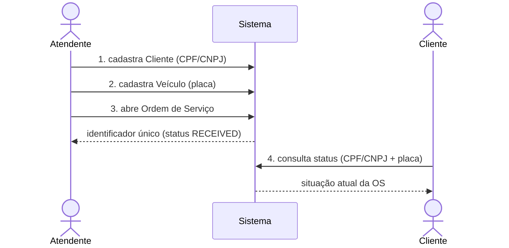
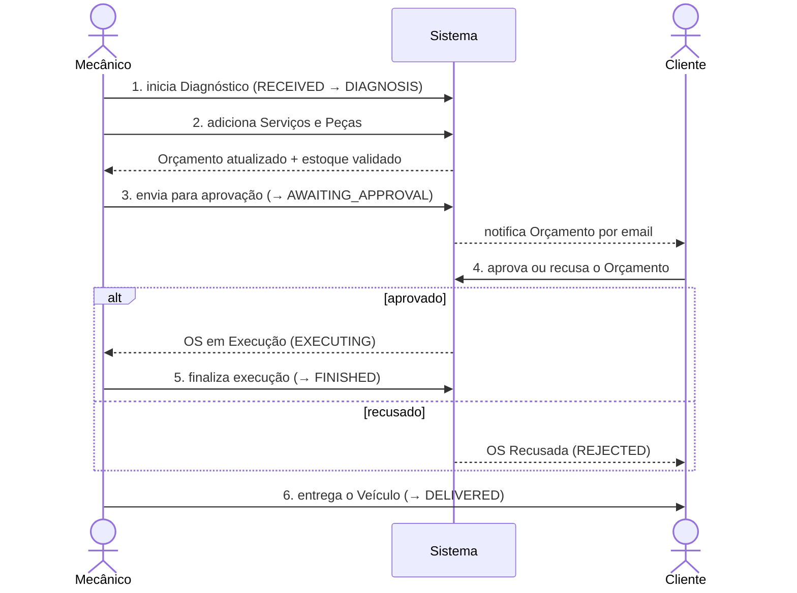

# Domain Storytelling — Oficina Mecânica

O **Domain Storytelling** narra, em linguagem ubíqua, como os atores do domínio
colaboram para realizar o trabalho. Cada história é uma sequência numerada de
sentenças no formato **Ator → atividade → objeto de trabalho → destinatário**,
acompanhada de um diagrama. As histórias abaixo cobrem os **dois fluxos
principais** do sistema e usam exatamente os termos do
[glossário da linguagem ubíqua](../README.md#linguagem-ubíqua-glossário).

## Atores e objetos de trabalho

| Atores | Objetos de trabalho |
|--------|---------------------|
| **Atendente** — recebe o cliente e abre a OS | **Cliente** (CPF/CNPJ) |
| **Mecânico** — diagnostica e executa | **Veículo** (placa) |
| **Cliente** — aprova/recusa e acompanha | **Ordem de Serviço (OS)** |
| **Sistema** — persiste, calcula e notifica | **Orçamento**, **Serviço**, **Peça** |

---

## História 1 — Abertura e acompanhamento da Ordem de Serviço

1. O **Atendente** cadastra o **Cliente** (CPF ou CNPJ) no **Sistema**.
2. O **Atendente** cadastra o **Veículo** (placa) do **Cliente** no **Sistema**.
3. O **Atendente** abre uma **Ordem de Serviço** para o **Veículo**; o **Sistema**
   devolve o **identificador único** da OS, com status inicial `RECEIVED`.
4. O **Cliente** consulta o **status da OS** informando CPF/CNPJ e placa, pela
   rota pública (sem autenticação).

---

## História 2 — Diagnóstico, orçamento, aprovação e execução

1. O **Mecânico** inicia o **Diagnóstico** da **OS** (`RECEIVED → DIAGNOSIS`).
2. O **Mecânico** adiciona **Serviços** e **Peças** à **OS**; o **Sistema**
   valida o estoque e mantém o **Orçamento** atualizado a cada item.
3. O **Mecânico** envia a **OS** para aprovação (`DIAGNOSIS → AWAITING_APPROVAL`);
   o **Sistema** consolida o **Orçamento** e **notifica por email**.
4. O **Cliente**, por um canal externo, **aprova** ou **recusa** o **Orçamento**
   no endpoint de aprovação:
   - **aprovado** → a **OS** entra em **Execução** (`AWAITING_APPROVAL → EXECUTING`);
   - **recusado** → a **OS** é **Recusada** (`AWAITING_APPROVAL → REJECTED`).
5. O **Mecânico** finaliza a execução (`EXECUTING → FINISHED`); o **Sistema**
   notifica por email.
6. O **Atendente** entrega o **Veículo** ao **Cliente** (`FINISHED → DELIVERED`).

---

## Do storytelling ao código

| Conceito do storytelling | Onde vive no código |
|--------------------------|---------------------|
| Ordem de Serviço + transições | `src/Domain/Aggregate/ServiceOrder.php` (Aggregate Root, máquina de estados) |
| Cliente, Veículo, Serviço, Peça | `src/Domain/Entity/*` |
| Orçamento (cálculo) | `ServiceOrder::calculateTotalAmount()` — atualizado a cada item adicionado |
| Notificação por email | `ServiceOrderStatusChangedEvent` → `StatusChangeEmailNotifier` |
| Aprovar / recusar | `ReviewBudgetUseCase` (`POST /api/service-orders/{id}/approval`) |
| Consulta pública de status | `GetServiceOrderByClientUseCase` (`GET /api/service-orders/status`) |
