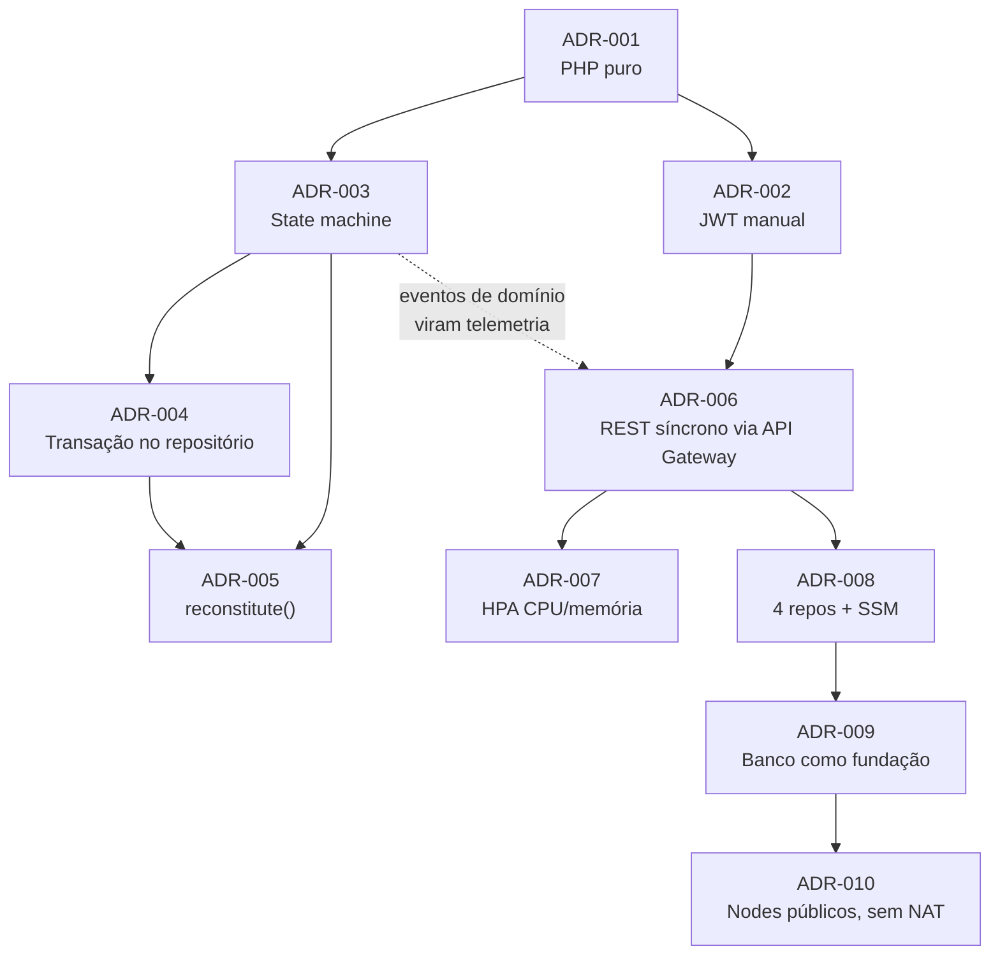

# Architecture Decision Records — Oficina Mecânica

Uma ADR registra **uma** decisão arquitetural relevante: o contexto em que ela foi tomada, a
decisão em si, o que se ganha e o que se perde, e as alternativas que foram descartadas. ADRs são
**imutáveis**: quando uma decisão muda, não se reescreve a ADR antiga — cria-se uma nova que a
supersede, e a antiga passa a `Substituída por ADR-NNN`.

Formato usado: `Status` · `Contexto` · `Decisão` · `Consequências` (positivas e negativas) ·
`Alternativas consideradas`.

## Índice

| ADR | Título | Fase | Status |
|---|---|---|---|
| [001](001-php-puro-sem-framework.md) | PHP 8.2 puro, sem framework MVC | 1 | Aceita |
| [002](002-jwt-implementado-manualmente.md) | JWT HS256 implementado manualmente | 1 | Aceita · ampliada na Fase 3 |
| [003](003-state-machine-metodos-nomeados.md) | Máquina de estados com métodos nomeados no Aggregate Root | 1 | Aceita |
| [004](004-transacoes-no-repositorio.md) | Controle transacional dentro do repositório | 1 | Aceita |
| [005](005-reconstitute-para-hidratacao.md) | `reconstitute()` para hidratação do agregado | 1 | Aceita |
| [006](006-comunicacao-sincrona-rest-api-gateway.md) | Comunicação síncrona REST via API Gateway | 3 | Aceita |
| [007](007-hpa-cpu-memoria.md) | Autoescalonamento por HPA em CPU e memória | 2 | Aceita · revisada na Fase 3 |
| [008](008-quatro-repositorios-acoplamento-ssm.md) | Quatro repositórios com acoplamento por SSM Parameter Store | 3 | Aceita |
| [009](009-banco-como-camada-de-fundacao.md) | O repositório de banco é a camada de fundação | 3 | Aceita |
| [010](010-nodes-em-subnet-publica-sem-nat.md) | Nodes do EKS em subnet pública, sem NAT Gateway | 3 | Aceita **com ressalva** |

## Como as decisões se relacionam

## Relação com as RFCs

Uma **RFC** avalia opções antes de uma decisão existir; uma **ADR** registra a decisão tomada. As
três RFCs desta fase estão em [`../rfc/`](../rfc/):

| RFC | Assunto | ADR resultante |
|---|---|---|
| [RFC-001](../rfc/001-escolha-da-nuvem.md) | AWS × GCP × Azure | fundamenta ADR-008, ADR-009, ADR-010 |
| [RFC-002](../rfc/002-banco-gerenciado.md) | RDS MySQL × Aurora Serverless v2 × RDS PostgreSQL × DynamoDB | fundamenta ADR-004, ADR-009 |
| [RFC-003](../rfc/003-estrategia-de-autenticacao.md) | Lambda + JWT HS256 × Cognito × mTLS | fundamenta ADR-002, ADR-006 |

## Decisões anteriores documentadas fora daqui

O `README.md` da raiz mantinha as ADRs 001 a 005 como parágrafos de uma frase. Na Fase 3 elas
foram migradas para cá no formato completo, e o README passou a apenas **linkar** este índice.
