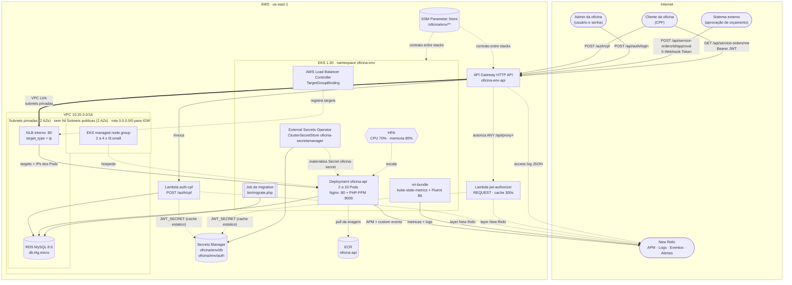

# Diagrama de componentes — visão de nuvem (Fase 3)

Visão dos componentes provisionados na AWS (`us-east-1`), das fronteiras de rede e de quem é dono
de cada recurso. A propriedade por repositório segue a seção 1 dos Contratos e a ADR-009.

## Visão geral

## Propriedade dos recursos

```mermaid
flowchart LR
    subgraph db["oficina-infra-database — fundação (durável)"]
        d1["VPC · subnets · IGW · route tables"]
        d2["SG de banco e SG cliente de banco"]
        d3["RDS MySQL 8.0"]
        d4["Secrets Manager: oficina/env/db e oficina/env/auth"]
        d5["migrations/NNN_slug.sql"]
    end
    subgraph k8s["oficina-infra-k8s — descartável"]
        k1["EKS + node group + IRSA"]
        k2["Add-ons Helm: LB Controller · metrics-server<br/>external-secrets · nri-bundle"]
        k3["ECR"]
        k4["NLB interno + target group + listener :80"]
        k5["Namespaces + ClusterSecretStore"]
    end
    subgraph lb["oficina-lambda-auth — descartável"]
        l1["Lambdas auth-cpf e jwt-authorizer"]
        l2["HTTP API · rotas · VPC Link · authorizer"]
    end
    subgraph app["oficina-mecanica-tech-challenge — descartável"]
        a1["deploy/base + overlays hml e prod"]
        a2["Deployment · Service · HPA · TargetGroupBinding"]
        a3["ExternalSecret oficina-secret"]
        a4["Job de migration"]
    end

    db -->|"SSM: network/* · db/* · auth/secret_arn"| k8s
    db -->|"SSM: network/private_subnet_ids · db/client_sg_id · db/* · auth/secret_arn"| lb
    k8s -->|"SSM: nlb/listener_arn · nlb/arn"| lb
    k8s -->|"SSM: ecr/repository_url · eks/cluster_name<br/>eks/namespace · nlb/target_group_arn"| app
    db -->|"SSM: db/* (Job de migration)"| app
```

Ordem de `apply`: **database → k8s → lambda → app**. Ordem de `destroy`: inversa.

## Notas de leitura

- **Nenhum repositório usa `terraform_remote_state`.** Toda seta pontilhada de acoplamento acima é
  um parâmetro do SSM Parameter Store com nome fixado na seção 2 dos Contratos (ADR-008).
- **O NLB, o target group e o listener nascem do Terraform** do `oficina-infra-k8s`, não do
  `Service` da aplicação (Adendo 1 dos Contratos). O motivo é a ordem de apply: o repositório da
  Lambda precisa do `listener_arn` para montar a integração do gateway, e aplica **antes** do
  repositório da aplicação. Se o NLB nascesse de um `Service` do tipo `LoadBalancer`, o ARN só
  existiria depois — invertendo a ordem contratada.
- **O AWS Load Balancer Controller apenas registra os Pods como targets**, através de um recurso
  `TargetGroupBinding` declarado no `deploy/` da aplicação e apontando para
  `/oficina/<env>/nlb/target_group_arn`. Como o target group é `target_type = ip`, os targets são
  os **IPs dos Pods**, e não os nodes — o tráfego não passa por `NodePort`.
- **O NLB é interno.** Não tem endereço público; só o VPC Link do API Gateway o alcança, e o VPC
  Link usa **as mesmas subnets privadas** do NLB (Adendo 4).
- **Nodes em subnet pública, sem NAT Gateway** (ADR-010). As subnets públicas têm rota
  `0.0.0.0/0` para o IGW — sem ela os nodes não entram no cluster (Adendo 3). O SG dos nodes não
  tem nenhuma regra de ingress vinda de `0.0.0.0/0`.
- **O RDS fica nas subnets privadas**, `publicly_accessible = false`, e aceita `3306` apenas do SG
  `oficina-<env>-db-client`, que é anexado aos nodes do EKS e às Lambdas.
- **O `ClusterSecretStore` chama-se `oficina-secretsmanager`** (Adendo 2); o `ExternalSecret` da
  aplicação materializa o `Secret` `oficina-secret` no namespace.
