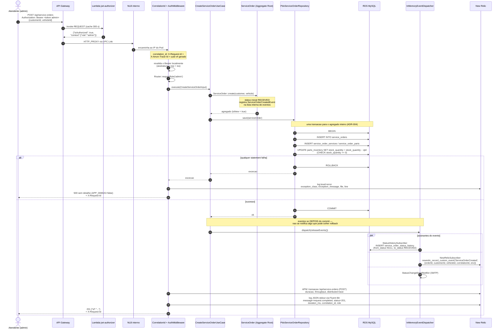
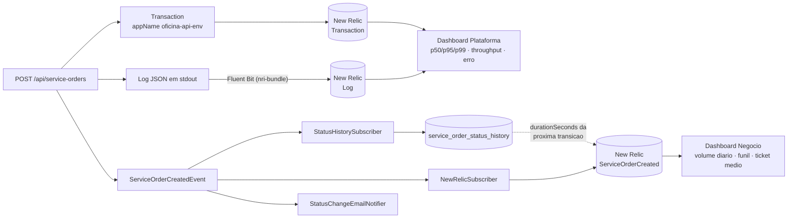

# Diagrama de sequência — abertura de Ordem de Serviço

Fluxo de `POST /api/service-orders` de ponta a ponta: o token atravessando o authorizer, chegando
ao Pod, a transação do agregado, o evento de domínio e a telemetria que ele produz.

Rota de **admin** (matriz de autorização, seção 5 dos Contratos): criar OS é operação de oficina,
não de cliente.

## Fluxo completo

## Telemetria produzida por esta requisição

## Notas

- **`correlation_id` amarra tudo.** Ele é lido de `X-Request-Id`, ou de `X-Amzn-Trace-Id` (que o
  API Gateway injeta), ou gerado como uuid v4. Vai para o log, vai como atributo dos dois custom
  events e volta **sempre** no header `X-Request-Id` da resposta — é o que permite, a partir de um
  erro relatado pelo usuário, achar a linha de log e o evento de negócio correspondentes.
- **Uma transação por agregado** (ADR-004). O Use Case chama `save()` e não sabe que existe
  transação; o repositório abre, persiste OS + serviços + peças + baixa de estoque, e faz commit
  ou rollback.
- **Eventos são despachados depois do commit.** Se fossem despachados antes, um rollback deixaria
  email enviado, histórico gravado e custom event emitido para uma OS que não existe.
- **`ServiceOrderCreated` não tem `durationSeconds`** — é o primeiro estado. O atributo aparece
  em `ServiceOrderStatusChanged`, calculado a partir da linha anterior de
  `service_order_status_history`, e é o que alimenta o painel de tempo médio por status.
- **`newrelic_record_custom_event()` é no-op silencioso** quando a extensão não está carregada
  (ambiente local e suíte de testes). Isso é deliberado: telemetria nunca quebra a aplicação.
- **A criação da OS é a única transição que consome estoque.** Reidratar o agregado usa
  `reconstitute()`, que não dispara evento nem toca em estoque (ADR-005) — por isso um `GET` não
  produz nada deste diagrama.
