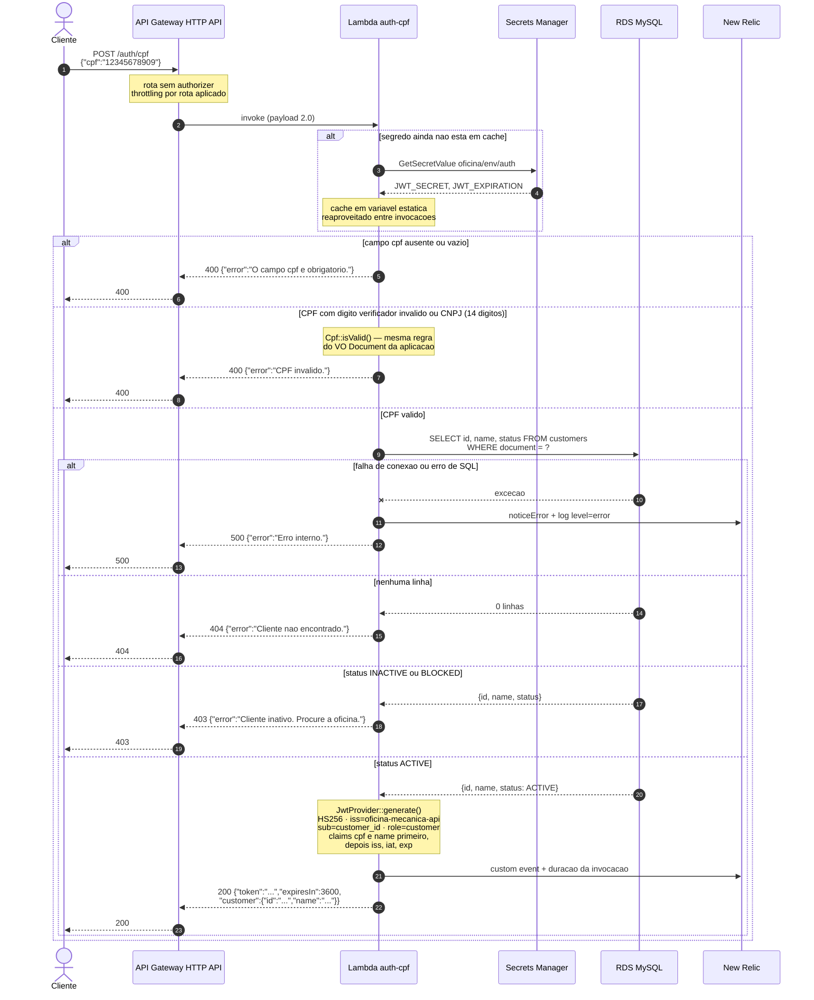
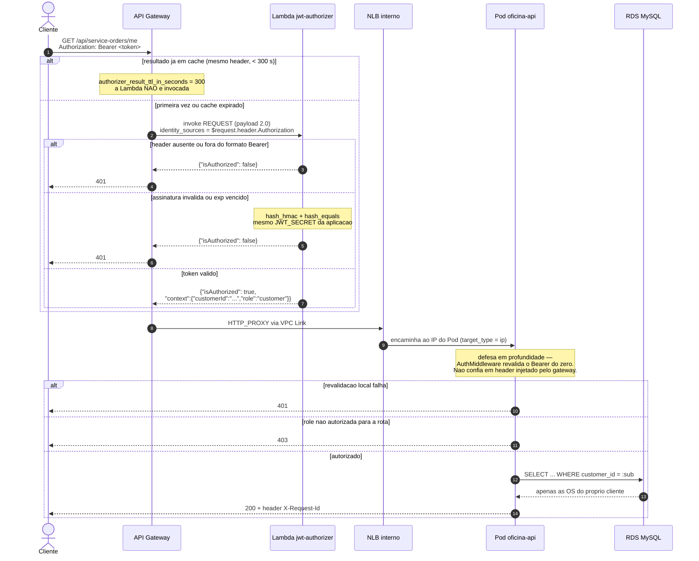

# Diagrama de sequência — autenticação do cliente por CPF

Fluxo de `POST /auth/cpf`, incluindo **todos os ramos de erro** da seção 5 dos Contratos.

Esta rota **não passa pelo authorizer** — é justamente onde o cliente obtém o token. Ela é servida
diretamente pela Lambda `auth-cpf`, que fica nas subnets privadas com o SG cliente de banco
anexado, e por isso alcança o RDS.

## Caminho feliz e ramos de erro

## Uso do token obtido

## Notas

- **`POST /api/auth/login` (admin)** passa pelo `ANY /api/{proxy+}`, ou seja, atravessa o
  authorizer — mas o `jwt-authorizer` **libera essa rota sem token**, checando `$request.path`. É
  o único caso de liberação por caminho, e existe porque é onde o admin obtém o dele.
- **404 e 403 são distinguíveis** em `POST /auth/cpf`. É um vazamento de enumeração aceito
  conscientemente (RFC-003): sem ele, o cliente bloqueado não saberia que precisa procurar a
  oficina. Já em `GET /api/service-orders/{id}`, o contrato manda **404 e não 403** quando o
  cliente não é o dono — ali a existência da OS é informação sensível.
- **O cache de 300 s do authorizer** significa que um cliente que passe a `BLOCKED` continua
  autorizado na borda por até 5 minutos. A revalidação no Pod é o que aplica a regra atual —
  não é redundância cerimonial.
- **CPF é identificação, não autenticação forte.** A mitigação é de autorização: o token de
  `role=customer` só dá leitura do que é dele, nunca escrita. Ver RFC-003, questão em aberto 1.
