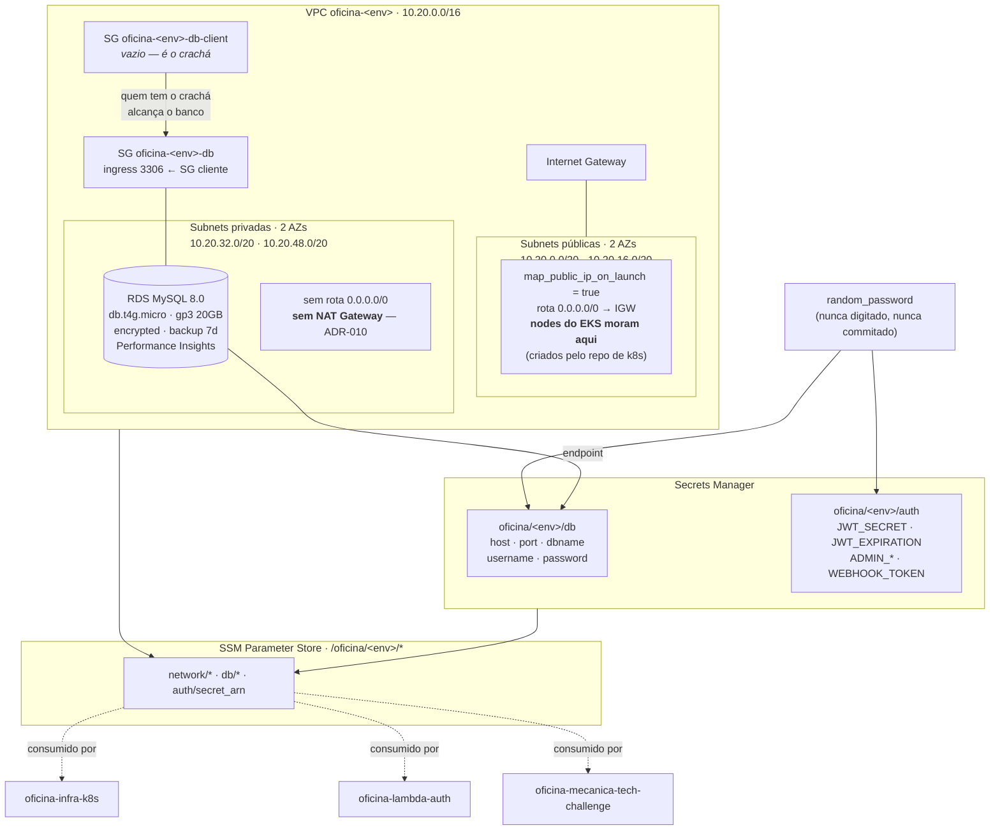
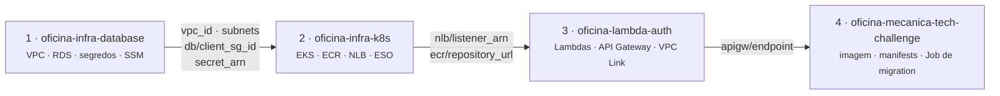

# oficina-infra-database

Infraestrutura de **fundação** da plataforma Oficina Mecânica: rede, banco de dados, segredos e
migrations SQL versionadas.

Este é o primeiro dos quatro repositórios a ser aplicado e o último a ser destruído. Ele possui
tudo que é **durável**: a VPC, o RDS e os segredos. O cluster EKS, as Lambdas e a aplicação podem
ser destruídos e recriados quantas vezes for necessário sem que este stack seja tocado — e sem que
nenhum dado seja perdido.

---

## Propósito

| Este repositório **é** dono de | Este repositório **não** toca em |
|---|---|
| VPC, subnets, Internet Gateway, route tables | EKS, node groups, add-ons Helm |
| Security groups de banco (`db` e `db-client`) | ECR, NLB interno |
| RDS MySQL 8.0, subnet group, parameter group | Lambdas, API Gateway, VPC Link |
| **Todos** os segredos do Secrets Manager (banco e JWT) | Deployment, Service, HPA da aplicação |
| Migrations SQL versionadas (`migrations/`) | Execução das migrations (é um Job do repo da app) |

O acoplamento com os outros três repositórios é **exclusivamente por SSM Parameter Store**.
Nenhum repositório usa `terraform_remote_state` de outro — ver [Parâmetros publicados](#parâmetros-ssm-publicados).

---

## Tecnologias

| Tecnologia | Versão | Papel |
|---|---|---|
| Terraform | >= 1.6 | IaC de todo o stack |
| AWS Provider | ~> 5.60 | Recursos AWS |
| Random Provider | ~> 3.6 | Geração das senhas e do `JWT_SECRET` |
| Amazon RDS for MySQL | 8.0 (`db.t4g.micro`) | Banco de dados relacional |
| AWS Secrets Manager | — | Segredos `oficina/<env>/db` e `oficina/<env>/auth` |
| AWS SSM Parameter Store | — | Contrato entre os quatro repositórios |
| S3 + DynamoDB | — | Backend remoto do state, com lock |
| GitHub Actions + OIDC | — | CI/CD sem access key estática |

Região: **`us-east-1`**. Ambientes: **`hml`** e **`prod`**, versionados em `envs/*.tfvars`
(sem workspaces).

---

## Arquitetura deste repositório



### O padrão do "crachá" (badge SG)

`oficina-<env>-db-client` é um security group **vazio**. Ele não concede nada por si só. Quem o
anexa — os nodes do EKS, as ENIs das Lambdas — passa a alcançar o RDS na porta 3306, porque o SG
`oficina-<env>-db` o referencia como origem de ingress.

O motivo de existir é evitar **dependência circular entre repositórios**: se o SG do banco
apontasse direto para o SG dos nodes do EKS, este repositório dependeria do repo de k8s, que já
depende deste para obter a VPC. Com o crachá, a dependência permanece unidirecional:
`database → k8s → lambda → app`.

### Por que não há NAT Gateway

Decisão deliberada de custo, registrada na **ADR-010**. Um NAT Gateway custa cerca de US$ 32/mês
por AZ mais o processamento de dados, o que dominaria todo o orçamento do desafio. Em vez disso:

- os **nodes do EKS ficam em subnets públicas**, com IP público para egress (puxar imagens do ECR,
  falar com a API do cluster, enviar telemetria ao New Relic). O tráfego de entrada é fechado por
  security group, não por posicionamento de subnet;
- as **subnets privadas continuam privadas**: sem rota para o IGW e sem NAT. Elas hospedam o RDS e
  as ENIs das Lambdas, que não precisam de internet.

> A rota `0.0.0.0/0 → IGW` na route table pública é **estrutural**, não decorativa: sem NAT em
> lugar nenhum da VPC, ela é o único caminho de egress dos nodes. Removê-la faz os nodes nunca
> entrarem no cluster.

---

## Estrutura

```
.
├── versions.tf              # required_version, providers, backend S3 parametrizável
├── providers.tf             # provider aws + default_tags
├── locals.tf                # name_prefix, tags, AZs, CIDRs das subnets
├── variables.tf             # todas as variáveis, com validação de environment
├── network.tf               # VPC, subnets, IGW, route tables
├── security_groups.tf       # SG db + SG db-client (padrão crachá)
├── rds.tf                   # subnet group, parameter group, instância MySQL
├── secrets.tf               # random_password + 2 segredos do Secrets Manager
├── ssm.tf                   # os 10 parâmetros do contrato
├── outputs.tf               # outputs do stack
├── envs/
│   ├── hml.tfvars
│   └── prod.tfvars
├── backend-hml.hcl.example  # modelo de -backend-config (bucket não é commitado)
├── backend-prod.hcl.example
├── migrations/
│   ├── 001_initial_schema.sql    # 7 tabelas, sem CREATE DATABASE e sem USE
│   ├── 002_fase3_ajustes.sql     # os 10 ajustes da Fase 3
│   └── 003_seed_demo.sql         # 120 OS em 30 dias, 7 status (só em hml)
├── docs/
│   └── MODELO-DE-DADOS.md        # ER, dicionário de dados, justificativa do banco
└── .github/workflows/
    ├── pr.yml               # fmt + validate + plan comentado no PR + migrations em MySQL real
    └── deploy.yml           # OIDC → apply → smoke test → marcador no New Relic
```

---

## Execução local

### Pré-requisitos

- Terraform >= 1.6
- Credenciais AWS com permissão sobre VPC, RDS, Secrets Manager e SSM
- Um bucket S3 para o state e a tabela DynamoDB `oficina-tflock` para o lock

### 1. Configurar o backend

O bucket **não é hardcoded** — é passado via `-backend-config`. Copie o modelo e preencha o
sufixo do seu bucket:

```bash
cp backend-hml.hcl.example backend-hml.hcl
# edite: bucket = "oficina-tfstate-<sufixo>"
```

### 2. Init

```bash
terraform init -backend-config=backend-hml.hcl
```

Ou passando os valores diretamente, sem arquivo:

```bash
terraform init \
  -backend-config="bucket=oficina-tfstate-<sufixo>" \
  -backend-config="key=oficina/oficina-infra-database/hml/terraform.tfstate" \
  -backend-config="region=us-east-1" \
  -backend-config="dynamodb_table=oficina-tflock" \
  -backend-config="encrypt=true"
```

### 3. Plan e apply

```bash
terraform plan  -var-file=envs/hml.tfvars
terraform apply -var-file=envs/hml.tfvars
```

Para produção, troque o `-backend-config` (key `.../prod/...`) e use `-var-file=envs/prod.tfvars`.

### Validação sem credenciais AWS

```bash
terraform fmt -check -recursive
terraform init -backend=false
terraform validate
```

### Validação das migrations sem AWS

As migrations são exercitadas contra um MySQL 8.0 real:

```bash
docker run -d --name oficina-mysql \
  -e MYSQL_ROOT_PASSWORD=root -e MYSQL_DATABASE=oficina_mecanica \
  -p 3306:3306 mysql:8.0

for f in migrations/*.sql; do
  mysql -h127.0.0.1 -uroot -proot oficina_mecanica < "$f"
done
```

O workflow `pr.yml` faz exatamente isso a cada PR — e **aplica tudo duas vezes**, para provar que
as migrations são idempotentes.

---

## Deploy (CI/CD)

Autenticação por **OIDC**, sem nenhuma access key estática.

| Workflow | Gatilho | O que faz |
|---|---|---|
| `pr.yml` | PR para `develop` ou `main` | `fmt -check`, `validate` e `plan` para `hml` e `prod`, com o plan comentado no PR; aplica as migrations em um MySQL 8.0 de serviço, duas vezes, e confere que o seed cobre os 7 status |
| `deploy.yml` | push em `develop` → `homologacao`<br/>push em `main` → `producao` | `apply` → smoke test dos 10 parâmetros SSM, do status do RDS e do formato dos dois segredos → marcador de deployment no New Relic |

Secrets de repositório esperados: `AWS_ROLE_ARN`, `AWS_ACCOUNT_ID`, `TF_STATE_BUCKET`,
`NEW_RELIC_API_KEY`, `NEW_RELIC_ACCOUNT_ID`.

O role assumido é `arn:aws:iam::<account>:role/oficina-gha-oficina-infra-database`.

---

## Parâmetros SSM publicados

Estes dez parâmetros são o **contrato** deste repositório com os outros três. Os nomes são
literais e não podem mudar sem atualizar a seção 2 de `docs/fase-3/CONTRATOS.md`.

| Parâmetro | Tipo | Conteúdo | Quem consome |
|---|---|---|---|
| `/oficina/<env>/network/vpc_id` | String | id da VPC | k8s, lambda |
| `/oficina/<env>/network/private_subnet_ids` | StringList | ids separados por vírgula | k8s, lambda |
| `/oficina/<env>/network/public_subnet_ids` | StringList | ids separados por vírgula | k8s |
| `/oficina/<env>/network/vpc_cidr` | String | `10.20.0.0/16` | k8s |
| `/oficina/<env>/db/client_sg_id` | String | SG "crachá" — **anexar nos nodes do EKS e na Lambda** | k8s, lambda |
| `/oficina/<env>/db/endpoint` | String | host do RDS, sem porta | app |
| `/oficina/<env>/db/port` | String | `3306` | app |
| `/oficina/<env>/db/name` | String | `oficina_mecanica` | app |
| `/oficina/<env>/db/secret_arn` | String | ARN do segredo de banco | k8s (ESO), app |
| `/oficina/<env>/auth/secret_arn` | String | ARN do segredo de autenticação | k8s (ESO), lambda |

Leitura a partir de outro stack Terraform:

```hcl
data "aws_ssm_parameter" "vpc_id" {
  name = "/oficina/${var.environment}/network/vpc_id"
}
```

### Segredos criados

| Segredo | Chaves |
|---|---|
| `oficina/<env>/db` | `host`, `port`, `dbname`, `username`, `password` |
| `oficina/<env>/auth` | `JWT_SECRET` (64), `JWT_EXPIRATION`, `ADMIN_USERNAME`, `ADMIN_PASSWORD` (32), `WEBHOOK_TOKEN` (32) |

Todos os valores vêm de `random_password`. **Nenhum segredo é digitado ou commitado.**

---

## Ordem de apply e destroy



**Apply:** `database` → `k8s` → `lambda` → `app`

**Destroy:** a ordem **inversa** — `app` → `lambda` → `k8s` → `database`.

Destruir fora de ordem falha: o `k8s` não consegue remover os nodes enquanto o SG crachá deste
stack estiver anexado a eles, e o `database` não consegue remover a VPC enquanto houver ENIs de
Lambda ou do EKS dentro dela.

Notas operacionais:

- Em `prod`, `deletion_protection = true` faz o `destroy` do RDS **falhar por projeto**. Desligar
  a proteção é um ato consciente: `terraform apply -var-file=envs/prod.tfvars` com
  `deletion_protection` desligado antes do destroy.
- Em `prod`, `skip_final_snapshot = false`: o destroy sempre deixa um snapshot final.
- Em `hml`, `recovery_window_in_days = 0` nos segredos, para que um ciclo destroy/apply possa
  reutilizar o mesmo nome imediatamente. Em `prod` a janela é de 7 dias.

---

## Migrations

Aplicadas em ordem lexicográfica pelo runner `bin/migrate.php` da aplicação, executado como um
Job do Kubernetes. O controle é a tabela `schema_migrations` — um arquivo já registrado nunca é
reexecutado.

| Arquivo | Conteúdo |
|---|---|
| `001_initial_schema.sql` | As 7 tabelas originais. Sem `CREATE DATABASE` e sem `USE`: o database é criado pelo próprio RDS. |
| `002_fase3_ajustes.sql` | Os 10 ajustes da Fase 3: `status`/`email`/`phone` em `customers`, tabela de histórico de status, índices, `ENUM` dos 7 estados, lock otimista em `parts_inventory`, `UNIQUE` nas tabelas de junção, `SMALLINT UNSIGNED` no ano, `DATETIME(3)`. |
| `003_seed_demo.sql` | Dados de demonstração. **Só em `hml`** — o runner pula arquivos com sufixo `_demo` quando `APP_ENV=production`. |

Nenhum arquivo usa `DELIMITER`; os statements são separados por `;` no fim da linha. Onde o MySQL
não aceita `IF NOT EXISTS` (`ADD COLUMN`, `ADD INDEX`, `ADD CONSTRAINT`), o `002` consulta o
`information_schema` e monta o `ALTER` com `PREPARE`/`EXECUTE`, caindo para `SELECT 1` quando o
objeto já existe.

O seed gera 10 clientes (CPFs com dígito verificador válido, incluindo um `INACTIVE` e um
`BLOCKED` para exercitar os `403` do `/auth/cpf`), 15 veículos, catálogo, estoque e **120 ordens
de serviço distribuídas nos últimos 30 dias cobrindo os 7 status**, com
`service_order_status_history` coerente — timestamps crescentes e durações plausíveis por etapa
(diagnóstico ~2 h, aguardando aprovação ~8 h, execução ~6 h). Todas as datas são relativas a um
instante de referência único (`@seed_now`), então o dashboard fica populado em qualquer dia em que
o seed for aplicado.

---

## Documentação

- [`docs/MODELO-DE-DADOS.md`](docs/MODELO-DE-DADOS.md) — diagrama ER, máquina de estados,
  dicionário de dados tabela a tabela, relacionamentos e a justificativa formal
  MySQL × PostgreSQL × Aurora × DynamoDB.
- `docs/fase-3/CONTRATOS.md` (repositório da aplicação) — documento normativo dos quatro repos.
- ADR-009 — este repositório como camada de fundação.
- ADR-010 — nodes em subnet pública, sem NAT Gateway.
