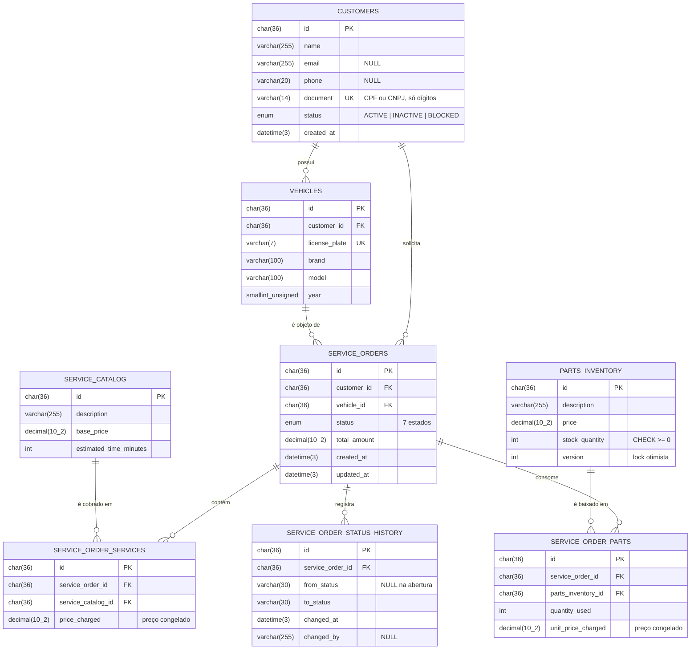
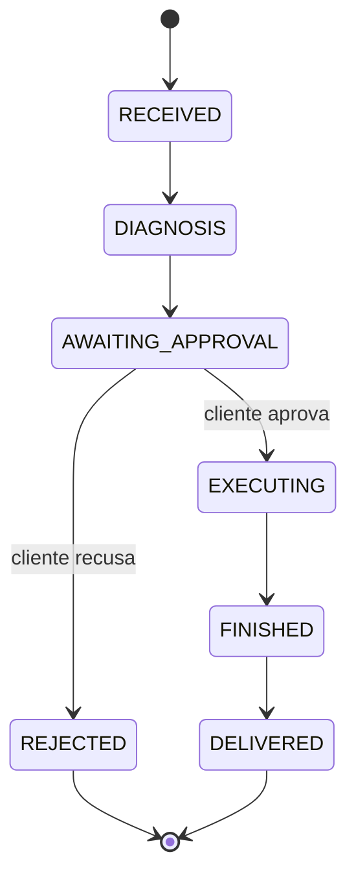

# Modelo de dados — Oficina Mecânica

Este documento descreve o modelo de dados persistido no RDS MySQL provisionado por este
repositório, e registra a **justificativa formal** da escolha do banco.

Todo o schema é criado pelas migrations versionadas em [`../migrations/`](../migrations/),
aplicadas em ordem lexicográfica pelo runner `bin/migrate.php` da aplicação e controladas pela
tabela `schema_migrations`.

---

## 1. Diagrama entidade-relacionamento

### Máquina de estados da ordem de serviço

Os sete estados são exatamente os do agregado `ServiceOrder` da aplicação, e desde a migration
`002` estão gravados no banco como `ENUM`. Isso transforma uma regra que só existia em PHP em
uma restrição que o banco também garante: nenhum `UPDATE` manual, script de correção ou
integração futura consegue gravar um status fora da máquina de estados.

---

## 2. Dicionário de dados

### 2.1 `customers`

Cliente da oficina — pessoa física (CPF) ou jurídica (CNPJ).

| Coluna | Tipo | Nulo | Descrição |
|---|---|---|---|
| `id` | `VARCHAR(36)` | não | UUID v4, gerado pela aplicação. Chave primária. |
| `name` | `VARCHAR(255)` | não | Nome ou razão social. Vai no claim `name` do JWT. |
| `email` | `VARCHAR(255)` | sim | Contato. Adicionado na Fase 3. |
| `phone` | `VARCHAR(20)` | sim | Contato, formato E.164. Adicionado na Fase 3. |
| `document` | `VARCHAR(14)` | não | CPF (11) ou CNPJ (14), **somente dígitos**. `UNIQUE`. |
| `status` | `ENUM('ACTIVE','INACTIVE','BLOCKED')` | não | Default `ACTIVE`. Adicionado na Fase 3. |
| `created_at` | `DATETIME(3)` | não | Default `CURRENT_TIMESTAMP(3)`. |

**Índices:** `PRIMARY (id)`, `uk_customers_document (document)`.

`document` é único porque é a chave de negócio real: é por ele que o `POST /auth/cpf` localiza o
cliente e emite o token. O índice único serve simultaneamente para integridade e para performance
dessa consulta, que está no caminho crítico de todo login de cliente.

`status` existe para atender a matriz de erros do `/auth/cpf`: um cliente `INACTIVE` ou `BLOCKED`
recebe `403` em vez de token. Antes da Fase 3 não havia como negar acesso a um cliente já
cadastrado sem apagá-lo — o que destruiria o histórico de ordens de serviço dele.

### 2.2 `vehicles`

Veículo pertencente a um cliente.

| Coluna | Tipo | Nulo | Descrição |
|---|---|---|---|
| `id` | `VARCHAR(36)` | não | UUID v4. Chave primária. |
| `customer_id` | `VARCHAR(36)` | não | FK → `customers.id`, `ON DELETE CASCADE`. |
| `license_plate` | `VARCHAR(7)` | não | Placa sem hífen (formato antigo ou Mercosul). `UNIQUE`. |
| `brand` | `VARCHAR(100)` | não | Marca. |
| `model` | `VARCHAR(100)` | não | Modelo. |
| `year` | `SMALLINT UNSIGNED` | não | Ano de fabricação. |

**Índices:** `PRIMARY (id)`, `uk_vehicles_license_plate (license_plate)`, `idx_vehicles_customer (customer_id)`.

`year` foi reduzido de `INT` (4 bytes) para `SMALLINT UNSIGNED` (2 bytes) na migration `002`. A
faixa `0..65535` cobre qualquer ano de fabricação plausível, e o tipo sem sinal elimina por
construção o ano negativo. É uma economia pequena por linha, mas é sobretudo uma **restrição de
domínio** aplicada no lugar certo.

`ON DELETE CASCADE` aqui é seguro: um veículo não tem existência independente do dono. Note que a
FK de `service_orders` para `customers` **não** é cascade — ver 2.5.

### 2.3 `service_catalog`

Catálogo de serviços oferecidos, com preço de tabela.

| Coluna | Tipo | Nulo | Descrição |
|---|---|---|---|
| `id` | `VARCHAR(36)` | não | UUID v4. Chave primária. |
| `description` | `VARCHAR(255)` | não | Nome do serviço. |
| `base_price` | `DECIMAL(10,2)` | não | Preço de tabela **atual**. |
| `estimated_time_minutes` | `INT` | não | Tempo estimado, base do prazo informado ao cliente. |

`base_price` é o preço vigente, não o preço cobrado. O preço efetivamente cobrado é copiado para
`service_order_services.price_charged` no momento em que o serviço entra na ordem — ver 2.6.

### 2.4 `parts_inventory`

Estoque de peças.

| Coluna | Tipo | Nulo | Descrição |
|---|---|---|---|
| `id` | `VARCHAR(36)` | não | UUID v4. Chave primária. |
| `description` | `VARCHAR(255)` | não | Descrição da peça. |
| `price` | `DECIMAL(10,2)` | não | Preço de tabela atual. |
| `stock_quantity` | `INT` | não | Saldo em estoque. `CHECK (stock_quantity >= 0)`. |
| `version` | `INT` | não | Contador de lock otimista. Default `0`. Adicionado na Fase 3. |

`version` e o `CHECK` formam juntos a proteção da operação mais perigosa do sistema: a **reserva
de estoque**. Duas ordens de serviço abertas ao mesmo tempo para a última peça disponível
precisam resultar em uma reserva bem-sucedida e uma falha explícita — nunca em estoque negativo.

O fluxo é: ler `(stock_quantity, version)`, e então
`UPDATE parts_inventory SET stock_quantity = stock_quantity - :q, version = version + 1 WHERE id = :id AND version = :v`.
Se `affected_rows = 0`, outra transação chegou primeiro e a operação é refeita ou rejeitada. O
`CHECK` é a segunda linha de defesa: mesmo que a aplicação erre a lógica, o banco recusa o
`UPDATE` que levaria o saldo abaixo de zero. Ver a seção 4.1 para por que isso pesou na escolha do
banco.

### 2.5 `service_orders`

Ordem de serviço — o agregado central do domínio.

| Coluna | Tipo | Nulo | Descrição |
|---|---|---|---|
| `id` | `VARCHAR(36)` | não | UUID v4. Chave primária. |
| `customer_id` | `VARCHAR(36)` | não | FK → `customers.id`. |
| `vehicle_id` | `VARCHAR(36)` | não | FK → `vehicles.id`. |
| `status` | `ENUM(...)` | não | Os 7 estados. Default `RECEIVED`. |
| `total_amount` | `DECIMAL(10,2)` | não | Soma de serviços + peças. Default `0.00`. |
| `created_at` | `DATETIME(3)` | não | Abertura da ordem. |
| `updated_at` | `DATETIME(3)` | não | `ON UPDATE CURRENT_TIMESTAMP(3)`. |

**Índices:** `PRIMARY (id)`, `idx_orders_status_created (status, created_at)`,
`idx_orders_customer (customer_id)`, `idx_orders_vehicle (vehicle_id)`.

O índice composto `(status, created_at)` é dimensionado para as duas consultas mais frequentes:
a tela de acompanhamento da oficina ("todas as ordens em `EXECUTING`, mais recentes primeiro") e
o dashboard ("quantas ordens por status nos últimos 30 dias"). A ordem das colunas importa:
`status` primeiro, porque é sempre um filtro de igualdade, e `created_at` depois, porque é a faixa
e a ordenação. Invertida, a mesma consulta viraria varredura.

`idx_orders_customer` sustenta o `GET /api/service-orders/me`, que filtra pelo `sub` do token.

As FKs para `customers` e `vehicles` são deliberadamente **`RESTRICT`** (o default), não cascade:
uma ordem de serviço é documento fiscal e histórico financeiro. Apagar um cliente não pode apagar
o histórico de faturamento dele — a operação simplesmente falha, e o caminho correto é marcar o
cliente como `INACTIVE`.

`total_amount` é um valor **derivado e materializado**. Poderia ser somado a cada leitura, mas as
telas de listagem exibem o total de dezenas de ordens ao mesmo tempo; recalcular exigiria dois
`JOIN` agregados por linha. Como o total só muda quando um item é adicionado ou removido — e isso
acontece dentro da mesma transação que altera o item —, materializar é seguro e barato.

### 2.6 `service_order_services`

Junção N:M entre ordens e o catálogo de serviços, com atributo próprio.

| Coluna | Tipo | Nulo | Descrição |
|---|---|---|---|
| `id` | `VARCHAR(36)` | não | UUID v4. Chave primária. |
| `service_order_id` | `VARCHAR(36)` | não | FK → `service_orders.id`, `ON DELETE CASCADE`. |
| `service_catalog_id` | `VARCHAR(36)` | não | FK → `service_catalog.id`. |
| `price_charged` | `DECIMAL(10,2)` | não | Preço **congelado** no momento da inclusão. |

**Índices:** `PRIMARY (id)`, `uk_sos_order_service (service_order_id, service_catalog_id)`.

`price_charged` é o ponto mais importante desta tabela. Se o preço fosse lido de
`service_catalog.base_price` na hora de exibir a ordem, um reajuste de tabela reescreveria
retroativamente o valor de ordens já fechadas e faturadas. Congelar o preço no ato torna a ordem
um documento imutável quanto ao valor.

O `UNIQUE (service_order_id, service_catalog_id)` impede a mesma ordem de listar o mesmo serviço
duas vezes — o que produziria cobrança duplicada silenciosa.

### 2.7 `service_order_parts`

Junção N:M entre ordens e peças, com quantidade e preço congelado.

| Coluna | Tipo | Nulo | Descrição |
|---|---|---|---|
| `id` | `VARCHAR(36)` | não | UUID v4. Chave primária. |
| `service_order_id` | `VARCHAR(36)` | não | FK → `service_orders.id`, `ON DELETE CASCADE`. |
| `parts_inventory_id` | `VARCHAR(36)` | não | FK → `parts_inventory.id`. |
| `quantity_used` | `INT` | não | Quantidade consumida. |
| `unit_price_charged` | `DECIMAL(10,2)` | não | Preço unitário congelado. |

**Índices:** `PRIMARY (id)`, `uk_sop_order_part (service_order_id, parts_inventory_id)`.

Como a quantidade é uma **coluna**, a mesma peça não deve aparecer em duas linhas da mesma ordem:
"3 unidades" é uma linha com `quantity_used = 3`, não três linhas. O `UNIQUE` transforma essa
regra em invariante do banco. Sem ele, uma dupla submissão de formulário geraria duas linhas, dois
débitos de estoque e um total inflado.

A FK para `parts_inventory` é `RESTRICT`: uma peça referenciada por qualquer ordem histórica não
pode ser removida do cadastro, sob pena de tornar ordens antigas ilegíveis.

### 2.8 `service_order_status_history`

Trilha de auditoria das transições de estado. Tabela nova na Fase 3.

| Coluna | Tipo | Nulo | Descrição |
|---|---|---|---|
| `id` | `CHAR(36)` | não | UUID v4. Chave primária. |
| `service_order_id` | `CHAR(36)` | não | FK → `service_orders.id`, `ON DELETE CASCADE`. |
| `from_status` | `VARCHAR(30)` | sim | Estado anterior. `NULL` na abertura da ordem. |
| `to_status` | `VARCHAR(30)` | não | Estado alcançado. |
| `changed_at` | `DATETIME(3)` | não | Instante da transição, precisão de milissegundos. |
| `changed_by` | `VARCHAR(255)` | sim | Autor: usuário admin, mecânico ou `system`. |

**Índices:** `PRIMARY (id)`, `idx_sosh_order_changed (service_order_id, changed_at)`,
`idx_sosh_status_changed (to_status, changed_at)`.

Esta tabela atende três necessidades ao mesmo tempo:

1. **Auditoria** — quem mudou o quê e quando, com precisão de milissegundos.
2. **Observabilidade** — o campo `durationSeconds` do custom event `ServiceOrderStatusChanged`
   é calculado como a diferença entre o `changed_at` atual e o anterior da mesma ordem. O índice
   `idx_sosh_order_changed` serve exatamente a esse `LAG`/lookup.
3. **Indicador de negócio** — "tempo médio em diagnóstico" e "tempo médio aguardando aprovação"
   são as métricas que o dashboard exibe. O índice `idx_sosh_status_changed` serve à agregação por
   status ao longo do tempo.

`from_status`/`to_status` são `VARCHAR(30)` e **não** `ENUM`, ao contrário de
`service_orders.status`. É intencional: uma tabela de auditoria precisa continuar legível mesmo
depois de a máquina de estados evoluir. Se um estado for renomeado ou removido no futuro, as
linhas históricas que o mencionam devem permanecer intactas — um `ENUM` obrigaria a reescrever ou
invalidar o histórico a cada mudança de domínio.

`created_at`/`updated_at` de todas as tabelas migraram de `TIMESTAMP` para `DATETIME(3)`. O
`TIMESTAMP` do MySQL tem o limite de 2038 e converte implicitamente para o fuso da sessão — dois
comportamentos indesejáveis quando os mesmos dados são lidos por uma aplicação em contêiner, por
uma Lambda e por consultas de dashboard. `DATETIME(3)` armazena o instante literal, e a aplicação
padroniza tudo em UTC.

---

## 3. Relacionamentos

| Relacionamento | Cardinalidade | Regra de exclusão | Justificativa |
|---|---|---|---|
| `customers` → `vehicles` | 1:N | `CASCADE` | Veículo não existe sem dono. |
| `customers` → `service_orders` | 1:N | `RESTRICT` | Ordem é histórico financeiro; não se apaga junto com o cliente. |
| `vehicles` → `service_orders` | 1:N | `RESTRICT` | O histórico do veículo sobrevive ao cadastro. |
| `service_orders` → `service_order_services` | 1:N | `CASCADE` | Itens não existem fora da ordem. |
| `service_orders` → `service_order_parts` | 1:N | `CASCADE` | Idem. |
| `service_orders` → `service_order_status_history` | 1:N | `CASCADE` | A trilha morre com a ordem. |
| `service_catalog` → `service_order_services` | 1:N | `RESTRICT` | Serviço referenciado não pode sumir. |
| `parts_inventory` → `service_order_parts` | 1:N | `RESTRICT` | Peça referenciada não pode sumir. |

As duas tabelas de junção materializam relações **N:M com atributos próprios**: uma ordem tem
vários serviços, um serviço aparece em várias ordens, e a associação carrega dados que não
pertencem a nenhum dos dois lados (`price_charged`, `quantity_used`). Esse é o caso clássico em
que a tabela associativa é uma entidade de pleno direito, e não um artefato técnico.

Um cliente se relaciona com uma ordem por **dois caminhos**: diretamente (`customer_id`) e
indiretamente via veículo (`vehicle_id` → `customers`). A redundância é proposital: permite
responder `GET /api/service-orders/me` com um único predicado indexado, sem `JOIN`, e preserva a
autoria da ordem mesmo que o veículo seja posteriormente transferido a outro dono.

---

## 4. Justificativa da escolha do banco de dados

**Decisão: Amazon RDS for MySQL 8.0, instância única `db.t4g.micro`.**

### 4.1 Por que um banco relacional, e não NoSQL

A escolha entre relacional e não relacional não é de gosto: decorre da forma dos dados e das
invariantes que precisam ser garantidas.

**Transações ACID na reserva de estoque.** Abrir uma ordem de serviço com peças é uma operação
que toca três tabelas: insere em `service_orders`, insere em `service_order_parts` e decrementa
`parts_inventory.stock_quantity`. Ou as três acontecem, ou nenhuma. Se o decremento de estoque
falhar depois da ordem ter sido gravada, a oficina passa a ter uma ordem prometendo uma peça que
não existe. Uma transação de banco relacional resolve isso com `BEGIN`/`COMMIT` e um lock
otimista de uma coluna. Em um banco de documentos sem transações multi-documento, a mesma
garantia exige implementar sagas com compensação — código de infraestrutura que não agrega valor
de negócio nenhum e concentra bugs de concorrência difíceis de reproduzir.

**Integridade referencial declarativa.** O modelo tem 8 chaves estrangeiras com semânticas
distintas de exclusão (`CASCADE` para itens, `RESTRICT` para histórico financeiro). Em um banco
relacional isso são oito linhas de DDL, garantidas pelo motor para *qualquer* cliente que se
conecte — a aplicação, o job de migration, um script de correção, um BI. Fora dele, a mesma
garantia vira código de aplicação replicado em cada consumidor, e basta um esquecer.

**Relacionamentos N:M.** `service_order_services` e `service_order_parts` são N:M com atributos.
Modelos agregados/documentais lidam bem com hierarquias 1:N (embutir os itens dentro da ordem),
mas N:M os obriga a escolher um lado para duplicar. Aqui os dois lados são consultados: "quais
serviços tem esta ordem" e "em quantas ordens este serviço apareceu no mês". A segunda pergunta é
justamente a que alimenta o dashboard.

**Consultas analíticas ad-hoc.** As métricas de negócio — tempo médio por etapa, ticket médio,
distribuição de ordens por status nos últimos 30 dias — são `GROUP BY` com janela sobre
`service_order_status_history`. Em SQL são consultas de poucas linhas. Sem SQL, cada métrica nova
exigiria uma nova estrutura de dados desnormalizada, mantida por escrita.

### 4.2 Comparativo

| Critério | **MySQL (RDS)** | PostgreSQL (RDS) | Aurora MySQL | DynamoDB |
|---|---|---|---|---|
| ACID multi-tabela | Sim (InnoDB) | Sim | Sim | Parcial (`TransactWriteItems`, ≤100 itens, mesma região) |
| Integridade referencial | Sim | Sim | Sim | **Não** — só na aplicação |
| N:M com atributos | Natural | Natural | Natural | Exige duplicação / índices secundários |
| Consulta analítica ad-hoc | SQL completo | SQL completo + janelas ricas | SQL completo | **Não** — só chave/índice; exige export |
| Custo mínimo mensal | **~US$ 12–15** (`db.t4g.micro`) | ~US$ 12–15 | ~US$ 45+ (mín. 1 instância + storage) | Baixo em on-demand, imprevisível sob varredura |
| Escala de leitura | Read replicas | Read replicas | **Até 15 réplicas, storage compartilhado** | Praticamente ilimitada |
| Failover | Multi-AZ, ~60–120 s | Multi-AZ, ~60–120 s | **~30 s** | Transparente |
| Familiaridade da equipe | **Alta** — já em uso | Média | Alta (compatível) | Baixa |
| Esforço de migração | **Zero** — schema já é MySQL | Reescrever DDL e SQL | Baixo | Reescrever todo o modelo |

### 4.3 Por que não PostgreSQL

Tecnicamente o PostgreSQL atenderia igualmente bem, e em alguns pontos melhor: `CHECK`
constraints mais expressivos, tipos `JSONB` e `ENUM` nativos superiores, funções de janela mais
ricas. **Nenhuma dessas vantagens é acionada por este modelo.** Não há dados semiestruturados, não
há consulta geoespacial, não há necessidade de tipos customizados.

Contra a mudança pesa que o schema da aplicação **já é MySQL** desde a Fase 1, o `PdoConnection` e
as queries existentes usam sintaxe MySQL, e a equipe tem fluência maior nele. Migrar seria
assumir custo de reescrita e risco de regressão em troca de recursos que o domínio não usa. A
decisão é conservadora por engenharia, não por inércia: **não se troca a fundação sem um problema
concreto que ela resolva.**

### 4.4 Por que não Aurora MySQL

Aurora é compatível com MySQL e resolveria eventual necessidade de escala de leitura e failover
mais rápido. O impedimento é **custo**: Aurora não tem classe equivalente à `db.t4g.micro` no
patamar de preço do RDS padrão, e o piso mensal salta para algo em torno de 3× o do RDS. Para uma
oficina mecânica com dezenas de ordens por dia — a carga real do projeto —, isso é pagar por uma
capacidade que jamais será exercida.

A migração RDS MySQL → Aurora MySQL é, além disso, um caminho de saída barato: mesmo dialeto,
mesmo schema, snapshot restaurável direto. Adotar RDS agora **não fecha a porta** de adotar Aurora
depois, se a carga justificar. Adotar Aurora agora fecharia a porta do orçamento.

### 4.5 Por que não DynamoDB

DynamoDB seria a escolha errada por três razões independentes, qualquer uma delas suficiente:

1. **Sem integridade referencial.** As oito FKs viram código de aplicação. O risco de ordem órfã
   ou peça inexistente passa a ser permanente.
2. **Padrões de acesso não são conhecidos de antemão.** DynamoDB exige modelar as tabelas a partir
   das consultas. Aqui as consultas mais valiosas são justamente as analíticas ad-hoc do
   dashboard, que evoluem a cada iteração do produto. Cada métrica nova exigiria repensar chaves
   de partição ou criar um GSI.
3. **N:M com atributos.** Modelar `service_order_parts` em DynamoDB significa duplicar o item sob
   duas chaves de partição e mantê-los sincronizados na escrita — reintroduzindo, na mão, o
   problema de consistência que o banco relacional resolve de graça.

### 4.6 Configuração escolhida e consequências

| Parâmetro | Valor | Motivo |
|---|---|---|
| Engine | MySQL 8.0 | Compatível com o schema existente; suporta `CHECK` e funções de janela. |
| Classe | `db.t4g.micro` | Graviton, melhor custo-desempenho da faixa; suficiente para a carga real. |
| Storage | gp3, 20 GB, autoscaling até 100 GB | gp3 tem IOPS baseline independentes do tamanho. |
| `storage_encrypted` | `true` | Criptografia em repouso, requisito de segurança. |
| Backup | 7 dias | Janela de recuperação com PITR. |
| Performance Insights | ligado, 7 dias | Diagnóstico de query lenta sem instrumentar a aplicação. |
| Multi-AZ | desligado | Custo. É a principal dívida assumida — ver abaixo. |
| `deletion_protection` | só em `prod` | Evita destruição acidental do ambiente produtivo. |
| `skip_final_snapshot` | só em `hml` | `hml` é descartável; `prod` sempre deixa snapshot final. |

**Consequência assumida:** sem Multi-AZ, uma falha de AZ implica indisponibilidade até o restore,
e uma atualização de versão causa uma janela de downtime. Para o escopo deste desafio isso é
aceitável e explicitamente reversível: `db_multi_az = true` no `envs/prod.tfvars` liga a réplica
síncrona sem nenhuma outra mudança de código. As duas subnets privadas em AZs distintas já existem
justamente para que essa mudança seja um `apply`, e não um redesenho.
