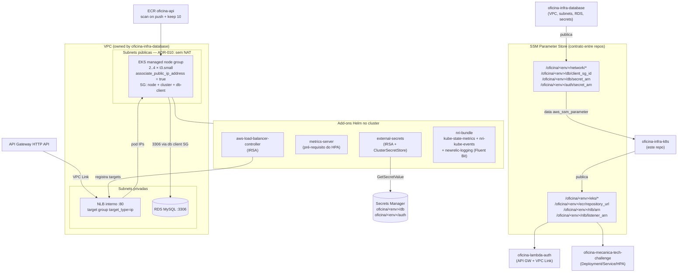

# oficina-infra-k8s

Camada de **computação** da Fase 3: cluster EKS, node group, IRSA, add-ons Helm, ECR,
NLB interno e os parâmetros SSM que os repositórios seguintes consomem.

Este repositório **não** cria rede, banco nem segredos — isso pertence a
`oficina-infra-database`. Todo o acoplamento acontece via **SSM Parameter Store**;
`terraform_remote_state` não é usado em lugar nenhum.

| Item | Valor |
|---|---|
| Região | `us-east-1` |
| Ambientes | `hml`, `prod` (arquivos `envs/*.tfvars`, sem workspaces) |
| Versão do EKS | `1.30` |
| Node group | 2× `t3.small`, min 2 / max 4, `capacity_type` variável (SPOT/ON_DEMAND) |
| Backend | S3 parametrizável + lock DynamoDB `oficina-tflock` |

---

## Arquitetura



---

## NLB: quem cria o quê

Existem duas formas de expor o `oficina-api` para o VPC Link, e elas são
mutuamente exclusivas. **Escolhemos a primeira** e é importante entender por quê.

### Escolha adotada — o Terraform é dono do NLB

O `aws_lb` interno, o `aws_lb_target_group` (`target_type = "ip"`) e o
`aws_lb_listener` na porta 80 são criados **aqui**, no Terraform (`nlb.tf`).

Motivo: `oficina-lambda-auth` precisa do ARN do NLB e do ARN do listener no
momento do `terraform apply` dele, para montar o VPC Link e a integração
`HTTP_PROXY`. Se o NLB fosse criado pelo AWS Load Balancer Controller a partir
de um `Service type=LoadBalancer`, o ARN só existiria **depois** do deploy da
aplicação — ou seja, a ordem `database → k8s → lambda → app` do contrato ficaria
impossível, e os parâmetros `/oficina/<env>/nlb/arn` e
`/oficina/<env>/nlb/listener_arn` só poderiam ser preenchidos por um passo
manual ou por um segundo apply. Com o NLB no Terraform, o SSM entrega ARNs
estáveis e utilizáveis antes de existir qualquer pod.

### Como os targets entram no target group

O Terraform **não** registra targets. Quem registra os IPs dos pods é o
**AWS Load Balancer Controller**, a partir de um objeto
`TargetGroupBinding` que o repositório da aplicação declara no seu overlay
kustomize, apontando para o target group deste repo:

```yaml
apiVersion: elbv2.k8s.aws/v1beta1
kind: TargetGroupBinding
metadata:
  name: oficina-api
  namespace: oficina-hml     # ou oficina-prod
spec:
  serviceRef:
    name: oficina-api
    port: 80
  targetType: ip
  targetGroupARN: <valor de /oficina/<env>/nlb/target_group_arn>
```

Por isso este repositório publica também
`/oficina/<env>/nlb/target_group_arn` (parâmetro **adicional** ao que a seção 2
dos Contratos lista — nenhum nome existente foi alterado).

### A alternativa que **não** foi adotada

Anotar o `Service` da aplicação com:

```yaml
service.beta.kubernetes.io/aws-load-balancer-type: external
service.beta.kubernetes.io/aws-load-balancer-nlb-target-type: ip
service.beta.kubernetes.io/aws-load-balancer-scheme: internal
```

faz o controller **criar o seu próprio NLB, target group e listener**. Isso
funciona perfeitamente, mas produziria um segundo NLB além do que o Terraform
cria (custo duplicado) e o ARN só ficaria conhecido depois do deploy da app.
Se o time preferir esse caminho no futuro, o correto é remover `nlb.tf` daqui e
alimentar `/oficina/<env>/nlb/*` a partir de um passo de CI do repositório da
aplicação — e o `oficina-lambda-auth` passaria a depender do app.

> **Resumo:** o NLB, o target group e o listener são criados pelo Terraform; o
> AWS Load Balancer Controller apenas registra os pods como targets via
> `TargetGroupBinding` a partir do `Service` da aplicação.

---

## Pré-requisitos

1. `oficina-infra-database` aplicado no mesmo ambiente (os parâmetros de rede,
   `db/client_sg_id`, `db/secret_arn` e `auth/secret_arn` precisam existir).
2. As **subnets públicas** publicadas em `/oficina/<env>/network/public_subnet_ids`
   precisam ter rota para o Internet Gateway — não há NAT (ADR-010).
3. Bucket de state `oficina-tfstate-<sufixo>` e tabela `oficina-tflock` criados.
4. Role OIDC `oficina-gha-oficina-infra-k8s` para o GitHub Actions.
5. `aws` CLI disponível na máquina/runner: os providers `kubernetes`, `helm` e
   `kubectl` autenticam via `aws eks get-token`.

---

## Uso

```bash
ENV=hml   # ou prod

terraform init \
  -backend-config="bucket=oficina-tfstate-<sufixo>" \
  -backend-config="key=oficina/oficina-infra-k8s/${ENV}/terraform.tfstate" \
  -backend-config="region=us-east-1" \
  -backend-config="dynamodb_table=oficina-tflock" \
  -backend-config="encrypt=true"

terraform plan  -var-file="envs/${ENV}.tfvars" -var="newrelic_license_key=$NEW_RELIC_LICENSE_KEY"
terraform apply -var-file="envs/${ENV}.tfvars" -var="newrelic_license_key=$NEW_RELIC_LICENSE_KEY"

aws eks update-kubeconfig --region us-east-1 --name "$(terraform output -raw cluster_name)"
kubectl get nodes
```

Validação sem credencial AWS (o teto do que dá para verificar offline):

```bash
terraform fmt -recursive
terraform init -backend=false
terraform validate
```

### SPOT vs ON_DEMAND

`capacity_type` existe justamente para isso: durante o desenvolvimento use
`SPOT` (`envs/hml.tfvars`), e para a entrega avaliada use `ON_DEMAND`
(`envs/prod.tfvars`), evitando que uma reclamação de spot derrube a demo.

---

## O que este repositório cria

| Arquivo | Conteúdo |
|---|---|
| `data.tf` | leitura do contrato SSM publicado por `oficina-infra-database` |
| `eks.tf` | cluster EKS 1.30 + managed node group em subnet pública, com o SG cliente de banco anexado |
| `ecr.tf` | repositório `oficina-api`, scan on push, lifecycle mantendo 10 imagens |
| `nlb.tf` | NLB interno, target group `ip` e listener `:80` |
| `addons-alb-controller.tf` | IRSA + Helm do AWS Load Balancer Controller |
| `addons-metrics-server.tf` | metrics-server (pré-requisito do HPA em `k8s/hpa.yaml`) |
| `addons-external-secrets.tf` | IRSA restrito aos 2 segredos, ESO via Helm e o `ClusterSecretStore` |
| `addons-newrelic.tf` | `nri-bundle` com kube-state-metrics, nri-kube-events e newrelic-logging |
| `namespaces.tf` | `oficina-hml` e `oficina-prod` |
| `ssm.tf` | publicação dos outputs no Parameter Store |

### ClusterSecretStore

Nome: **`oficina-secretsmanager`**. Provider AWS SecretsManager em `us-east-1`,
autenticação `jwt` pela service account `external-secrets/external-secrets`
(IRSA). O `ExternalSecret` da aplicação materializa o `Secret` `oficina-secret`
no namespace do ambiente, conforme a seção 3 dos Contratos.

A política IAM concede `GetSecretValue`/`DescribeSecret` **apenas** nos ARNs de
`oficina/<env>/db` e `oficina/<env>/auth` (com sufixo `*` para cobrir o sufixo
aleatório dos ARNs do Secrets Manager).

---

## Segurança de rede dos nodes

Cada node recebe três security groups:

1. o SG de node criado pelo módulo EKS (tráfego node↔control plane e node↔node);
2. o security group primário do cluster;
3. **`/oficina/<env>/db/client_sg_id`**, que abre `3306` no RDS.

Como não há NAT, os nodes ficam em subnet pública com IP público
(`associate_public_ip_address = true` no launch template). Nenhuma porta de
entrada é aberta para a internet — o SG de node não tem ingress `0.0.0.0/0`; o
acesso HTTP vem só do NLB interno, restrito ao CIDR da VPC.

---

## Ordem de apply / destroy entre repositórios

```
apply:    oficina-infra-database  →  oficina-infra-k8s  →  oficina-lambda-auth  →  oficina-mecanica-tech-challenge
destroy:  oficina-mecanica-tech-challenge  →  oficina-lambda-auth  →  oficina-infra-k8s  →  oficina-infra-database
```

Antes de destruir este repositório, remova os workloads da aplicação: o AWS Load
Balancer Controller precisa estar vivo para desregistrar os targets, e um
`TargetGroupBinding` órfão impede a exclusão do target group.

Este cluster é **descartável**: pode ser destruído e recriado sem tocar em rede,
banco ou segredos, que vivem na camada de fundação.

---

## CI/CD

| Workflow | Gatilho | O que faz |
|---|---|---|
| `pr.yml` | PR para `develop`/`main` | `fmt -check`, `init -backend=false`, `validate`, `tflint`, e `plan` de `hml` e `prod` comentado no PR |
| `deploy.yml` | push em `develop` → `homologacao`; push em `main` → `producao` | OIDC → `apply` → smoke test (`kubectl get nodes`, rollout dos add-ons, `ClusterSecretStore`, namespaces) → marca deployment no New Relic |

Autenticação por OIDC (`aws-actions/configure-aws-credentials@v4`), sem access
key estática. Segredos esperados: `AWS_ROLE_ARN`, `AWS_ACCOUNT_ID`,
`TF_STATE_BUCKET`, `NEW_RELIC_LICENSE_KEY`, `NEW_RELIC_ACCOUNT_ID`,
`NEW_RELIC_API_KEY`.
