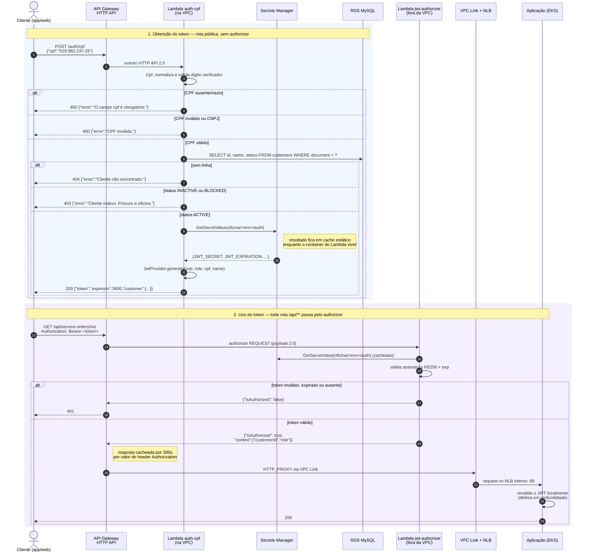

# oficina-lambda-auth

Funções serverless de autenticação da **Oficina Mecânica** e o **API Gateway HTTP API**
que serve de porta de entrada única da plataforma.

Este repositório é dono de dois recursos de computação e de todo o gateway:

| Recurso | O que faz |
|---|---|
| Lambda `oficina-<env>-auth-cpf` | `POST /auth/cpf` — identifica o cliente pelo CPF e emite o JWT |
| Lambda `oficina-<env>-jwt-authorizer` | Lambda authorizer REQUEST do HTTP API — valida o JWT antes de qualquer rota `/api/**` |
| API Gateway HTTP API, rotas, VPC Link, authorizer | Roteamento público e integração com o NLB interno do cluster |

Ele **não** cria VPC, subnets, RDS, segredos, cluster nem load balancer. Tudo isso
pertence a `oficina-infra-database` e `oficina-infra-k8s`, e chega aqui **exclusivamente
por SSM Parameter Store** — nunca por `terraform_remote_state`.

---

## Fluxo de autenticação por CPF



### A rota que o authorizer libera sem token

`POST /api/auth/login` passa pelo `ANY /api/{proxy+}` e portanto cai no authorizer —
mas é justamente onde o **admin obtém** o token. Exigi-lo ali tornaria o login
inalcançável. O `JwtAuthorizerHandler` compara método + caminho e devolve
`isAuthorized: true` com `role: public` para essa combinação exata (e só para ela:
`GET /api/auth/login` e `POST /api/auth/login-as-admin` continuam bloqueados).

> ⚠️ **Consequência do `identity_sources`.** Os Contratos fixam
> `identity_sources = ["$request.header.Authorization"]`. Com isso, o API Gateway
> responde **401 sem sequer invocar o authorizer** quando o header não vem. Na prática,
> o cliente precisa enviar um header `Authorization` qualquer no login (ex.:
> `Authorization: Bearer public`), ou o `identity_sources` precisa ser removido — o que
> desliga o cache de 300s. Ponto que depende de decisão humana; ver
> `docs/fase-3/status/WS-C.md`.

---

## Contrato do JWT — e o teste que o protege

Os dois lados que manipulam o token vivem em repositórios separados, com deploys
independentes: **esta Lambda emite**, a **aplicação no EKS valida**. Não há pacote
comum nem build conjunto que os force a concordar.

`tests/Contract/JwtContractTest.php` é o teste mais importante deste repositório. Ele
gera um token com segredo, payload e `iat` fixos e compara com a **string literal**
publicada em `docs/fase-3/contract-token.md`. A aplicação tem um teste espelho, com a
mesma string. Se qualquer um dos lados mudar a montagem do JWT — a ordem das claims no
JSON, o `iss`, o padding do base64url — o teste daquele lado fica vermelho no CI antes
do merge, em vez de o erro aparecer como 401 em produção com o usuário na frente.

Ordem de montagem (seção 4 dos Contratos): as claims específicas primeiro
(`sub`, `role`, `cpf`, `name`), depois `iss`, `iat`, `exp`.

Se o teste quebrar, a resposta quase nunca é atualizar a string esperada. É descobrir o
que mudou no `JwtProvider` e reverter.

---

## Estrutura

```
src/
  Domain/Cpf.php                     validação de CPF (réplica do Document VO da aplicação)
  Security/JwtProvider.php           cópia byte a byte do JwtProvider da aplicação
  Secrets/SecretsManagerProvider.php Secrets Manager com cache estático entre invocações
  Repository/PdoCustomerRepository.php  SELECT id, name, status FROM customers
  Handler/AuthCpfHandler.php         regra da rota POST /auth/cpf
  Handler/JwtAuthorizerHandler.php   regra do authorizer
handler-auth.php                     amarração fina com o Bref (auth-cpf)
handler-authorizer.php               amarração fina com o Bref (jwt-authorizer)
*.tf                                 infraestrutura (Lambdas, IAM, HTTP API, VPC Link)
envs/{hml,prod}.tfvars               parâmetros por ambiente
```

### Por que os handlers não conhecem o Bref

`AuthCpfHandler` e `JwtAuthorizerHandler` são classes puras: recebem um array (o evento)
e devolvem um array (a resposta), com todas as dependências injetadas por construtor.
Os arquivos `handler-*.php` apenas montam as dependências reais e delegam.

Isso torna toda a tabela de erros testável ramo a ramo sem AWS, sem banco e sem o
runtime do Bref instalado — e permite que o `phpunit` rode em qualquer máquina.

### Cache de segredos

`SecretsManagerProvider` guarda o segredo decodificado numa propriedade **estática**.
O Lambda reaproveita o container entre invocações, então da segunda requisição em diante
não há chamada de rede nem consumo de cota da API do Secrets Manager.

Contrapartida aceita: uma rotação do segredo só é percebida quando a AWS recicla o
container. Para forçar antes disso, publique uma nova versão da função (o
`terraform apply` já faz isso a cada deploy) ou chame `SecretsManagerProvider::flushCache()`.

---

## Contrato HTTP

### `POST /auth/cpf`

Requisição: `{"cpf": "52998224725"}` (aceita com ou sem máscara).

| Situação | Status | Corpo |
|---|---|---|
| CPF válido, cliente `ACTIVE` | 200 | `{"token":"...","expiresIn":3600,"customer":{"id":"...","name":"..."}}` |
| CPF com dígito verificador inválido | 400 | `{"error":"CPF inválido."}` |
| Campo `cpf` ausente ou vazio | 400 | `{"error":"O campo cpf é obrigatório."}` |
| CPF não cadastrado | 404 | `{"error":"Cliente não encontrado."}` |
| Cliente `INACTIVE` ou `BLOCKED` | 403 | `{"error":"Cliente inativo. Procure a oficina."}` |
| Falha de banco / erro interno | 500 | `{"error":"Erro interno."}` |

Só CPF (11 dígitos) é aceito. CNPJ — mesmo com dígitos verificadores válidos — retorna 400.

Um CPF sintaticamente inválido **nunca chega ao banco**: a validação acontece antes,
economizando conexão e reduzindo a superfície exposta a entrada arbitrária.

### Authorizer

Resposta sempre no formato *simple response*:

```json
{"isAuthorized": true, "context": {"customerId": "...", "role": "customer", "sub": "..."}}
```

Para `role=admin`, `customerId` vem vazio (o `sub` é o nome de usuário do admin, não um
id de cliente). A aplicação **não confia** nesse contexto: ela revalida o JWT localmente.

---

## Arquitetura de rede

| Função | Rede | Motivo |
|---|---|---|
| `auth-cpf` | **dentro** da VPC, subnets privadas, SG cliente de banco lido do SSM | precisa alcançar o RDS |
| `jwt-authorizer` | **fora** da VPC | só valida assinatura; ficar fora evita ENI e cold start extra no caminho de **toda** requisição |

O VPC Link usa **as mesmas subnets privadas** em que o NLB interno foi criado pelo repo
de Kubernetes (`/oficina/<env>/network/private_subnet_ids`), e a integração
`HTTP_PROXY` aponta para o listener `:80` lido de `/oficina/<env>/nlb/listener_arn`.

### Parâmetros SSM consumidos

`/oficina/<env>/network/vpc_id`, `/network/private_subnet_ids`, `/network/vpc_cidr`,
`/db/client_sg_id`, `/db/secret_arn`, `/auth/secret_arn`, `/nlb/listener_arn`.

### Parâmetros SSM publicados

`/oficina/<env>/apigw/endpoint`, `/oficina/<env>/apigw/api_id`.

---

## IAM — privilégio mínimo

| Permissão | `auth-cpf` | `jwt-authorizer` |
|---|:--:|:--:|
| `logs:CreateLogStream` / `PutLogEvents` no **próprio** log group | ✅ | ✅ |
| `secretsmanager:GetSecretValue` no segredo de **auth** | ✅ | ✅ |
| `secretsmanager:GetSecretValue` no segredo de **banco** | ✅ | ❌ |
| `AWSLambdaVPCAccessExecutionRole` | ✅ | ❌ |

Roles separadas de propósito: o authorizer nunca fala com o RDS, então não recebe nem a
credencial do banco nem a permissão de manipular ENIs.

---

## Observabilidade

- **Log groups** criados explicitamente com retenção gerenciada (14d em hml, 30d em prod).
- **Access log do stage `$default`** em JSON, uma linha por request, com
  `correlation_id` (`$context.requestId`) — o mesmo campo que a aplicação usa no log
  estruturado, permitindo correlacionar gateway e aplicação.
- **Extensão New Relic para Lambda** anexada como layer nas duas funções. Usamos a
  extensão pura (`NewRelicLambdaExtension`), que drena o log group e envia métricas de
  invocação/erro/duração sem exigir wrapper de handler — o Bref/PHP não tem agente de
  Lambda próprio. A license key é lida do Secrets Manager, nunca de variável em claro.

> O ARN do layer New Relic é **específico da região**. Conferir em
> <https://layers.newrelic-external.com/> antes de aplicar.

---

## Versões dos layers — confira antes de aplicar

Nenhum dos dois ARNs de layer tem valor eternamente correto:

| Layer | Onde conferir |
|---|---|
| Bref `php-82` | <https://runtimes.bref.sh/> ou `aws lambda list-layer-versions --region us-east-1 --layer-name arn:aws:lambda:us-east-1:534081306603:layer:php-82 --query 'LayerVersions[0].Version'` |
| New Relic | <https://layers.newrelic-external.com/> ou `aws lambda list-layer-versions --region us-east-1 --layer-name arn:aws:lambda:us-east-1:451483290750:layer:NewRelicLambdaExtension --query 'LayerVersions[0].LayerVersionArn'` |

Os valores em `envs/*.tfvars` são pontos de partida. Aplicar com uma versão inexistente
falha no `apply` com `ResourceNotFoundException` — falha barulhenta, não silenciosa.

---

## Desenvolvimento local

A máquina de desenvolvimento do desafio não tem PHP nem Composer. Use os wrappers Docker
da raiz do monorepo de trabalho:

```bash
./scripts/composer.sh install -d /app/repos/oficina-lambda-auth
./scripts/php.sh php repos/oficina-lambda-auth/vendor/bin/phpunit -c repos/oficina-lambda-auth/phpunit.xml
./scripts/php.sh php repos/oficina-lambda-auth/vendor/bin/phpstan analyse -c repos/oficina-lambda-auth/phpstan.neon --no-progress
```

Com PHP local disponível, o `Makefile` cobre o mesmo:

```bash
make install
make test        # PHPUnit (inclui o teste de contrato)
make stan        # PHPStan nível 8
make package     # gera build/lambda.zip
make fmt
make validate
```

### Terraform

```bash
terraform fmt -check -recursive
terraform init -backend=false && terraform validate
```

Sem credencial AWS, `validate` com `-backend=false` é o teto de verificação possível —
e é o critério de "pronto" desta rodada.

Com credencial:

```bash
terraform init -backend-config=backend-hml.hcl
terraform plan -var-file=envs/hml.tfvars -var=lambda_package_path=build/lambda.zip
```

---

## Empacotamento e deploy

`scripts/build-package.sh` gera `build/lambda.zip` com `src/`, `vendor/` (sem dev) e os
dois arquivos de handler. **As duas Lambdas recebem exatamente o mesmo artefato** — o
que as diferencia é o `handler` configurado no Terraform. É de propósito: garante que o
`JwtProvider` que emite e o que valida sejam o mesmo código.

| Workflow | Gatilho | O que faz |
|---|---|---|
| `pr.yml` | PR para `develop`/`main` | teste de contrato → PHPUnit → PHPStan; `terraform fmt/init/validate` |
| `deploy.yml` | push em `develop` → `hml`; push em `main` → `prod` | testes → zip → OIDC → `terraform apply` → smoke test → marca deployment no New Relic |

Autenticação AWS por **OIDC** (`aws-actions/configure-aws-credentials@v4`), sem nenhuma
access key estática.

Ordem de `apply` entre repositórios: **database → k8s → lambda → app**. Este stack
depende dos parâmetros SSM dos dois primeiros e falha no `plan` se eles não existirem.
